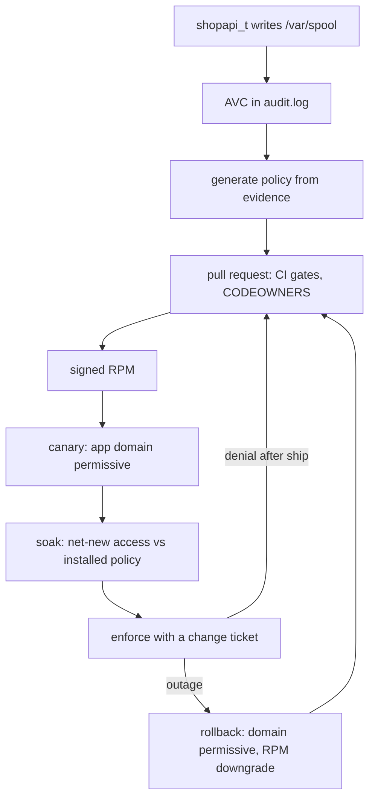

# SELinux for Developers and Administrators

> SELinux is not a tax on deployment. It is the only part of your RHEL host that still contains
> an application after an attacker compromises the application. This book teaches you to read it,
> write it, test it, review it, and ship it as code, with evidence.

<p class="kicker">Security as code for Linux services</p>

<p class="cover-meta">First edition &middot; built from the
<a href="https://github.com/anurag-saran/selinux-pac">selinux-pac</a> repository &middot;
every example runnable, most of them offline</p>

::: toc
:::

## What you will be able to do

By the last page you can do all of the following without a search engine and without a
consultant:

- Read a denial out of `audit.log` and say which rule is missing, in English, in under a minute.
- Write a policy module with its types, `.te`, `.fc`, and ports. Make it small enough to review
  and correct enough to compile on the first try.
- Turn a denial into a reviewed commit instead of a command you ran on the production host.
- Explain to a change board what a per-domain permissive soak is, how long it runs, and what
  evidence closes it.
- Roll back a policy that caused an outage without disabling SELinux on the host.

## Who this book is for

| You are | You will use | Chapters |
|---|---|---|
| **An application developer** whose service is denied | the generator, the fixtures, the PR review gates | 3, 13–17 |
| **A RHEL administrator** who owns production | RPMs, Ansible, canary/soak/enforce, rollback | 5, 18–21 |
| **An SRE on the incident bridge** at 02:00 | the incident card and the break-glass rules | 20 |
| **New to SELinux entirely** | everything, in order | 1 onward |
| **On a laptop with no Linux host** | the offline fixture suites | Your Lab, 15 |

## The story: one denial, one path

The book follows a single denial. It starts when a kernel hook refuses the access. It ends when a
reviewed module enforces in production. Every chapter is a station on that path.



Two rules hold for the whole book, and the tooling enforces both:

1. **The host stays in Enforcing mode.** Only the application's own domain becomes permissive,
   and only during the canary.
2. **Production is never mutated by hand.** A denial after ship opens a pull request. It does
   not start a shell on the production host.

## The repository you will use

Everything runs against [selinux-pac](https://github.com/anurag-saran/selinux-pac). It is a
working policy-as-code pipeline. It holds a deterministic generator that reads AVCs, a CI gate
that refuses dangerous rules, and offline golden fixtures. It also holds RPM packaging and the
Ansible/AAP promotion path. Clone it once, then read [Your Lab](lab.md):

```bash
git clone https://github.com/anurag-saran/selinux-pac
cd selinux-pac
make deps && make check
```

`make check` is the spine of the book. It runs the deterministic generator against golden
fixtures, checks the app manifests, and lints the policy. It needs no SELinux host. Once
`make deps` installs the Python requirements, it needs no network. If a chapter claims a
behavior, a fixture under `docs/examples/fixtures/deterministic/` usually proves it.

## How to read this book

The book has three paths through the material. Take the one that matches the question you arrived
with.

| Your question | Read |
|---|---|
| "Why did my service get denied?" | 1, 2, 3, 4, then 13 |
| "I have to write policy this sprint" | 6, 7, 8, 9, 13, 14, 15, 17 |
| "I run production for a living" | 2, 5, 11, 18, 19, 20, 21 |
| "I inherited a host full of one-off modules" | 12, 17, 22, 25 |
| "I am on call tonight" | 20 |

::: note Reading order
Chapters 1–5 build the mental model. Read them in order, even if you know RHEL well. They are the
vocabulary that every later chapter assumes. From Part II onward, you can jump freely. Each
chapter states its own prerequisites in the opening paragraph.
:::
