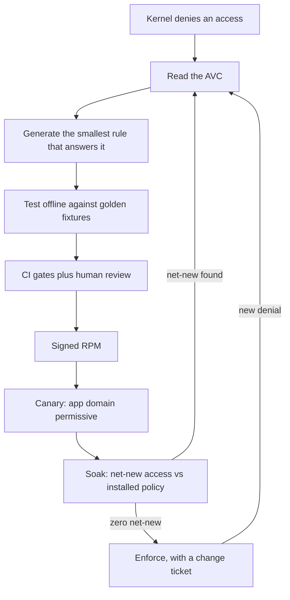

# The Default Answer

> A release is blocked, a denial is in the log, and someone says the words: "just turn SELinux
> off." This chapter is about that moment — what it protects, what it costs, and the three
> questions that decide whether the quick fix is the cheap one or the expensive one.

## A composite outage

The following scenario is a composite, not one company's incident report. Every element of it
is ordinary; that is the point.

A payments service moves its scratch directory from `/var/lib/payments/spool` to
`/var/spool/payments`. The change is one line in a config file, committed, reviewed, and
deployed. In staging, SELinux is permissive because "the container hides it". In production, a
few hundred requests succeed — the service writes the first batches into the new path, which the
old directory label still covers — and then traffic ramps up, a rotation job touches a path
nobody labeled, and requests start returning 500. `audit.log` fills with denials:

```text
avc:  denied  { write } for  pid=8812 comm="payments" name="spool"
  scontext=system_u:system_r:payments_t:s0
  tcontext=system_u:object_r:var_spool_t:s0
  tclass=dir permissive=0
```

Five people are on the bridge. The fastest way to restore service is one command:

```bash
# setenforce 0      # do not do this; shown because it is what happens
```

The service recovers. The incident closes with "SELinux issue, disabled to restore service".
Nobody labels `/var/spool/payments`; nobody runs `restorecon`; the actual bug — *a path change
that the policy was never told about* — ships again next quarter, on a host that no longer has
a confinement layer to catch it.

::: story Why the quick fix wins the first five minutes
`setenforce 0` is *correct* at the level of immediate recovery: it stops the kernel from
blocking the service. Every argument against it loses in the first five minutes because it is
fast, reversible in appearance, and requires no understanding. The argument for policy as code
has to be won on a different axis: **cost over a year**, and **evidence at the change board**.
:::

## What disabling SELinux actually costs

Turning SELinux off does not remove a feature; it removes a *layer*, and with it the answers
to questions nobody else on the host can answer.

| The layer provides | With SELinux Enforcing | With SELinux disabled |
|---|---|---|
| Confinement after compromise | a compromised service is restricted to its own files, ports and processes | the service inherits the Unix privileges of its account, e.g. can read every world-readable file |
| A record of attempted access | every denial is an audited kernel decision with subject, target, class, permission | nothing to read; the attempt simply succeeds |
| Blast-radius arithmetic | you can enumerate what a domain may touch with `sesearch` | unknowable without manual auditing of every process |
| Change review | a policy diff is a reviewable artifact that CI gates | there is no artifact; the change is a shell setting on a host |
| Recovery | roll back a module, downgrade an RPM, or make one domain permissive | re-enabling means a full filesystem relabel — a maintenance window |

The last row is the one that traps people. Permissive-to-enforcing transitions trigger a
relabel of the filesystem; on a busy host with millions of inodes, that is not a change you make
casually during business hours. So "temporarily off" becomes permanent by default.

## Three questions that decide the fix

When a denial reaches a change board, the discussion is rarely about SELinux. It is about risk.
A policy-as-code answer has ready answers to the three questions that always come up.

| Question | The answer from this book |
|---|---|
| **What is the evidence?** | The AVC lines, the generator's classification of each one, and the resulting access delta — reviewed in the pull request. |
| **What is the blast radius if this rule is wrong?** | Named types only (`payments_spool_t`, not `var_t`), no wildcards, no `bin_t` execution; the CI gate refuses the dangerous shapes before review. |
| **How do we undo it?** | A signed RPM you can downgrade, a module you can remove, and a rollback playbook that puts only the app domain back to permissive. |

::: why This is the whole argument of the book
You cannot win the outage argument by being right about SELinux. You win it by making the
correct path **faster than the shortcut**: a generator that produces the fix in one command, CI
that tests it without a host, and a pipeline that ships it without a maintenance window.
Everything in Parts III and IV exists to make the first row of that table cheap.
:::

## The loop this book teaches



Read it as a single sentence: **a denial is a question, and the loop is the answer.** Chapters 2
through 5 give you the vocabulary to read the question; Chapters 6 through 12 the language to
answer it; Chapters 13 through 17 the tooling to test and review the answer; Chapters 18 through
21 the machinery to ship it.

## What the kernel actually asked

Back to the outage. The denial was not a bug report about a path; it was a precise question:

> May the process domain `payments_t` write to a directory labeled `var_spool_t`?

The correct answer is a sentence an administrator can review: *no — but it may write to
`payments_spool_t`, and `/var/spool/payments` should carry that label.* That is two changes, both
of them reviewable: one line of file-context policy, and one `restorecon` at deploy time.

::: try Your first denial, safely
On the lab host from [Your Lab](lab.md), watch a real denial without breaking anything:

```bash
# sudo ausearch -m avc -ts recent | tail -n 5
```

You may see nothing — a quiet host denies nothing that is not already handled. Chapter 4 goes
looking for denials deliberately; Chapter 15 does it with fixtures so you never need a noisy
production host to learn on.
:::

Chapter 2 explains what "domain" and "labeled" mean at the kernel level, so that the sentence
above reads as precisely as it looks.
