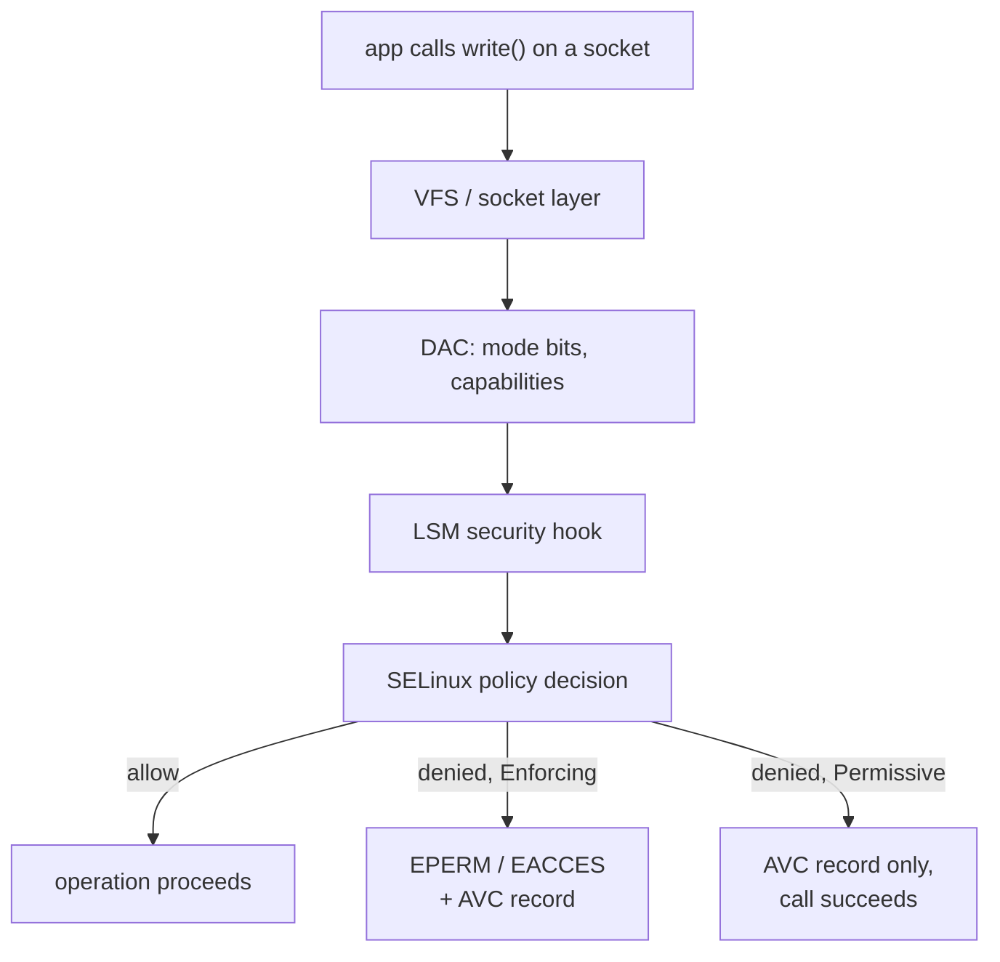

# What SELinux Actually Checks

> Every denial in `audit.log` is the answer to one tuple of four values. Learn the tuple and the
> log stops looking like noise: it becomes `subject, target, class, permission` — and the missing
> rule writes itself.

## Two questions about one `open()`

When a process opens a file, Linux asks two independent questions.

| | Classic Unix (DAC) | SELinux (MAC) |
|---|---|---|
| Question | does this **user** have permission on this **file**? | may this **domain** do this **permission** to this **type**? |
| Decided by | owner/group/mode bits, plus capabilities | the loaded policy; the file's owner is irrelevant |
| Set by | `chmod`, `chown`, `setfacl` | `.te`, `.fc`, `semanage`, `restorecon` |
| Bypassed by | `root` (mostly) | nothing, including `root` |
| Visible with | `ls -l` | `ls -Z`, `ps -eZ` |

Both checks run. Passing the Unix check does not excuse you from the SELinux check, and vice
versa. That is what "mandatory" means: a compromised service running as a privileged account is
still confined by the policy for its domain, because the policy does not consult the account.

## Where the kernel asks

SELinux is implemented as a Linux Security Module. The kernel calls into it from security hooks
placed at the points where an operation becomes irreversible — file access, socket operations,
process control, IPC — and each hook asks the policy a question.



Two consequences follow from this picture.

- **No hook, no check.** Operations the kernel does not mediate are not mediated by SELinux
  either. Chapter 25 lists what is deliberately out of scope.
- **The decision is per operation, not per program.** One request can produce a dozen decisions:
  bind a port, read a config, write a log, `fork`, connect to a database.

## The decision tuple

Four values, and the policy either contains a matching `allow` rule or the answer is no.

| Value | Where it comes from | Example |
|---|---|---|
| **Source type** (domain) | the label of the running process | `system_u:system_r:shopapi_t:s0` |
| **Target type** | the label of the object being accessed | `system_u:object_r:shopapi_var_lib_t:s0` |
| **Object class** | the kind of object | `file`, `dir`, `tcp_socket`, `process` |
| **Permission** | the requested operation | `write`, `search`, `name_bind`, `fork` |

A rule is exactly that tuple, written out:

```text
allow shopapi_t shopapi_var_lib_t:dir { search add_name write };
```

Read it as: *processes labeled `shopapi_t` may search, add names to, and write entries in
directories labeled `shopapi_var_lib_t`.* The AVC that produced it carried the same four values
in a different order.

::: why The tuple is the whole mental model
When the tuple is clear, so is the review. A rule that names a broad target type —
`allow shopapi_t var_t:file write;` — is legible as dangerous because the **target type** is a
category that covers thousands of unrelated files. A rule that names `shadow_t` is legible as
forbidden. Chapter 17 turns exactly these readings into a review checklist.
:::

## Object classes and permissions

The class decides which permissions are even meaningful. `write` exists for `file` and `dir`;
`name_bind` exists for TCP sockets; `fork` exists for processes. The kernel's AVC names the class,
and that is why the field can be trusted.

| Class | Typical permissions you will meet | Denial looks like |
|---|---|---|
| `file` | `read write open getattr setattr append execute entrypoint map` | service cannot write a log |
| `dir` | `search add_name remove_name write open getattr` | service cannot create a file |
| `lnk_file` | `read getattr` | symlink target cannot be followed |
| `tcp_socket` | `bind name_bind connect name_connect listen accept` | service cannot listen on a port |
| `process` | `fork transition sigchld siginh rlimitinh` | service cannot start under its own domain |
| `capability` | `net_bind_service dac_override chown` | service cannot use a kernel capability |
| `system` | `module_load` | loading a policy module is refused |

The permission sets are not decorative: a policy that grants `write` on a `file` has not granted
`create`, and a process that needs to create the file needs the `dir` permissions too. This is
the single most common cause of "but I added the rule and it still fails" — Chapter 4 shows the
second, third and fourth denial that follow the first fix.

## Default deny, and what permissive changes

SELinux policy is default-deny: absence of an allow rule is a denial. Whether that denial blocks
anything depends on the mode of **that domain**.

| Mode | Set with | Effect on a denied operation |
|---|---|---|
| Enforcing | the default | operation fails; AVC written with `permissive=0` |
| Domain permissive | `semanage permissive -a shopapi_t` | operation proceeds; AVC written with `permissive=1` |
| System permissive | `setenforce 0` or `SELINUX=permissive` | every domain logs instead of blocking |

::: warn `permissive=1` is not success
In a permissive domain, the application keeps running *while being denied*. A data path that
fails intermittently, or a security control that silently does nothing, is common. Read
`permissive=1` in an AVC as "this would have broken in Enforcing" — which is precisely why the
soak in Chapter 19 treats net-new denials as a blocking signal even though the service looks
healthy.
:::

Chapter 5 covers the modes and their traps in detail; for now, note the granularity: the unit of
enforcement is the domain, not the host.

## Why a quiet host still has policy

On a stock RHEL system you will not see denials all day. Three reasons:

1. **The vendor policy already covers shipped software.** `sshd_t`, `httpd_t`, `named_t` and
   friends have policy written by the distribution, tested by many hosts.
2. **The targeted policy leaves much of user space unconfined.** `unconfined_t` exists and has
   broad allows, so interactive shells mostly do not generate denials.
3. **Denials are cached and rate-limited.** The AVC is an access *vector cache*: the decision is
   cached per tuple, and repeat denials are coalesced by the kernel and auditd.

Your application is different. It is the one with a custom domain, custom paths, and a custom
port — and that custom surface is precisely where the kernel starts answering *no*.

::: try Read labels on your own host
Nothing here changes state; it only sets the vocabulary for Chapter 3.

```bash
$ getenforce                 # Enforcing / Permissive / Disabled
$ ls -Z /usr/bin/passwd      # object label: note the third field, the type
$ ps -eZ | head              # process labels: the third field is the domain
$ id -Z                      # your own shell's context
$ ls -Z /var/log | head -n 5 # labelled log files, many with dedicated types
```

On a RHEL host you should expect `Enforcing`, and file types like `passwd_file_t` and process
domains like `unconfined_t`.
:::

## One tuple, in full

Here is a real denial and its reading, using the same four values.

```text
avc: denied { write } for pid=8812 comm="payments" name="spool"
  scontext=system_u:system_r:payments_t:s0
  tcontext=system_u:object_r:var_spool_t:s0
  tclass=dir permissive=0
```

| Value | In this AVC |
|---|---|
| source type | `payments_t` (the `scontext`'s third field) |
| target type | `var_spool_t` (the `tcontext`'s third field) |
| object class | `dir` |
| permission | `write` |
| mode | enforcing (`permissive=0`) |

The missing rule is therefore `allow payments_t var_spool_t:dir write;` — and the *right* answer is
usually not to add it. Chapter 4 explains what to do with the four values, Chapter 9 why the
better fix for this one is a label on `/var/spool/payments`, and Chapter 13 how the generator
makes that decision for you.

::: note What comes next
Chapter 3 opens up the label itself — the four colon-separated fields, why only the third one
matters for enforcement, and how a file gets its label in the first place.
:::
