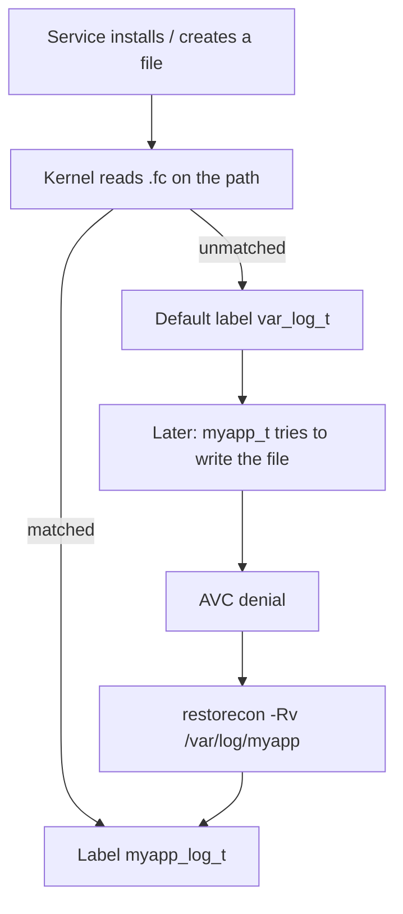

# File Contexts and the Label Lifecycle

> A new `.fc` line writes a rule for *future* files — not the ones already on disk.
> The label a process sees when it touches a path is whatever `ls -Z` actually shows,
> not whatever your rule book says it should show.

## Why `.fc` lines look boring and still break your service

`.te` rules earn the headline because they are the *allows*. `.fc` lines are the
address book — each one says "a file at this path gets this label". The kernel
reads `.fc` at object creation time, not at `open()` time, and the rule is what
decides what label a brand-new file wears. If the path was never written into
the policy, the kernel assigns it whatever type the directory already carries —
usually a base type such as `var_lib_t` or `var_log_t` — and the access falls
into the default-deny pile.

That is why the single most common cause of "but the rule I added lets my app
write — why is it still failing" is a `.fc` line that was never added: the
domain is allowed to touch the type, the file is actually `var_lib_t`, and no
one told the kernel to call it `myapp_var_lib_t`.

## The `.fc` format — one regex per line

Each line is a regex anchored to the whole path, followed by a call to
`gen_context(...)`. The file in the repo, [`selinux/myapp.fc`](../../selinux/myapp.fc),
is the worked example:

```text
/opt/myapp/app\.py                          gen_context(system_u:object_r:myapp_exec_t,s0)
/var/lib/myapp(/.*)?                        gen_context(system_u:object_r:myapp_var_lib_t,s0)
/var/log/myapp/.*\.log(\.[0-9]+)?(\.gz)?    gen_context(system_u:object_r:myapp_log_t,s0)
/run/myapp(/.*)?                            gen_context(system_u:object_r:myapp_var_run_t,s0)
```

Each piece earns its place.

| Piece | What it does | Why the syntax |
|-------|--------------|----------------|
| `/opt/myapp/app\.py` | an exact file | `\.` escapes the literal dot; without escaping the dot becomes "any char" |
| `/var/lib/myapp(/.*)?` | everything under the directory | `(/.*)?` is the trailing slash + any sub-tree; the `?` makes the group optional so the root itself is covered |
| `/var/log/myapp/.*\.log(\.[0-9]+)?(\.gz)?` | rotated logs | `.*` grabs everything; `(\.[0-9]+)?` and `(\.gz)?` are optional suffixes for the numbering and the gzip |
| `gen_context(system_u:object_r:myapp_var_lib_t,s0)` | the label | `system_u` and `object_r` are fixed for files; only the type and level vary |

Two rules about the regex itself:

1. **It must match the whole path.** The kernel anchors with `^` and `$` against the
   literal path, so a pattern that stops halfway misses the file.
2. **`(/.*)?` is the shape of "under this directory, plus the root."** Write
   every directory you put state in as a `(/.*)?` regex, not an exact path: you
   will add files under it before the soak ends.

The `gen_context(...)` helper compresses the four fields SELinux stores. The
leading `system_u:object_r` is fixed for files — processes get `system_r`,
anything else is uncommon — so the line only varies on the type and the level
(`s0` here, which is the project's "default" level).

## Why there are two copies of `/opt/myapp`

[`selinux/myapp.fc`](../../selinux/myapp.fc) lists every path twice:

```text
/opt/myapp/app\.py                          gen_context(...)
/opt/myapp/backend_stub\.py                 gen_context(...)
/opt/myapp/bin(/.*)?                        gen_context(...)
/opt/myapp/venv/bin/python[0-9.]*           gen_context(...)
/opt/myapp/venv(/.*)?                       gen_context(...)
/var/opt/myapp                              gen_context(...)
/var/opt/myapp/app\.py                      gen_context(...)
/var/opt/myapp/bin(/.*)?                    gen_context(...)
/var/opt/myapp/venv/bin/python[0-9.]*       gen_context(...)
/var/opt/myapp/venv(/.*)?                   gen_context(...)
```

The manifest names both roots — [`config/myapp.manifest.yml`](../../config/myapp.manifest.yml):
`install_root: /opt/myapp`, `var_opt_dir: /var/opt/myapp`. On Fedora CoreOS `/opt`
is a symlink that points to `/var/opt`, so the same binary lives at two
absolute paths. Every path the package puts a file under must be matched, or
the kernel falls back to the directory's type. The duplicate lines look
redundant; they are actually *insurance* for whichever root is on the box.

The generator, [`cli/fc_labeling.py`](../../cli/fc_labeling.py), knows the same trick. It
checks each proposed `.fc` line against existing lines by turning the regex
into a probe path and running `re.match(pattern, path)`. A line that matches
an existing regex's anchor type is marked **redundant** — the file gets that
type already. Only a genuinely new anchor gets appended.

## The lifecycle — create, label, drift, restorecon

The label is assigned the moment the file is created, not when it is opened.
The order is:



Step *B* is the lookup. The kernel walks every line of `.fc` against the new
path. Match wins — the file is born labelled. No match — the file inherits the
type of the directory it lives in. Step *F* is the failure you actually see:
`ls -Z` shows `var_log_t` and the rule `allow myapp_t myapp_log_t:file write`
does not cover `var_log_t`.

Two consequences of this timing:

- **A new `.fc` line rules for new files only.** It does not reach back and
  relabel what is already on disk.
- **`restorecon` is the relabel.** It walks the filesystem and writes each label
  the policy expects into the in-memory extended attribute.

## Reading and writing labels on the box

Two commands, one read, one write. Both need a SELinux host — a laptop only
reads the fixture.

```bash
# ask the policy what it expects:
$ matchpathcon /var/log/myapp/data.log
/var/log/myapp/data.log    system_u:object_r:myapp_log_t:s0

# ask the box what it actually shows:
$ ls -Z /var/log/myapp/data.log
system_u:object_r:var_log_t:s0    /var/log/myapp/data.log
```

When the two disagree, `restorecon` writes the policy's expectation into the
filesystem.

```bash
$ sudo restorecon -Rv /var/lib/myapp /var/log/myapp /run/myapp /opt/myapp
```

| Flag | Meaning |
|------|---------|
| `-R` | Recursive — every file under each path |
| `-v` | Verbose — print each path that changed |
| `-n` | Dry run — show what *would* change, change nothing |

The dry run is `restorecon -Rv -n <paths>`. Every line it prints is a pending
relabel; every silent line is already correct. This repo's deploy pipeline runs
the dry run first — [`scripts/verify_file_contexts.sh`](../../scripts/verify_file_contexts.sh)
wraps the call — and refuses to restart until the dry run shows no changes.

## Persistent overrides with `semanage fcontext`

Sometimes the file-context list is right but the box never ran `restorecon` —
maybe it was a long-running box, maybe it was a VM from a snapshot, maybe it
was a backup restore. In that case, `semanage fcontext` stores the rule in
the persistent policy so every future `restorecon` has something to apply:

```bash
# add one path, same syntax as an .fc line
$ sudo semanage fcontext -a -t myapp_var_lib_t '/var/lib/myapp(/.*)?'

# list what is stored
$ sudo semanage fcontext -l

# remove it
$ sudo semanage fcontext -d '/var/lib/myapp(/.*)?'

# equivalence: keep the type but add another root
$ sudo semanage fcontext -a -e /var/lib/myapp /var/opt/myapp
```

`-a` adds an entry, `-l` lists, `-d` deletes. `-e` is an *argument of an action*, not an action
of its own: `semanage fcontext -a -e <target> <path>` adds a new entry that reuses an existing
entry's type. It takes path prefixes, not regexes, so `/var/lib/myapp(/.*)?` is not a valid
argument — you pass the directory. The equivalence switch is the answer to the `/var/lib/myapp` /
`/var/opt/myapp` question: one type, two roots, no second `.fc` line.

## Drift — what it is and why it is invisible

A file's label drifts away from the policy at the moment of creation. The
causes a service author actually meets:

| Cause | What happens | Why it is invisible |
|-------|--------------|---------------------|
| `cp` from outside | a new inode inherits *source* label, not policy | the source was not part of the policy |
| `tar` extraction | every entry gets the archive's metadata | the archive never asked the policy |
| `cp` across filesystems | the destination filesystem picks `generic_t` | the source label never copied |
| package installs a directory | the package runs before the policy exists | the type is whatever the base policy gives the directory |
| `mv` within one filesystem | label stays | the metadata did not move; only the path did |
| tmpfs / overlay mount | every file on it is `tmp_t` / `container_t` | the filesystem owns the type |
| container bind-mount | source inode label is whatever the host gave it | the container sees only the inode |

Each of these produces the same symptom: `ls -Z` disagrees with
`matchpathcon`, and every denial is "but the rule I added allows the write" —
the rule allows, the file does not carry the type the rule covers. Drift is
invisible until enforcing: the default targeted policy treats user-space
processes as `unconfined_t`, which has wide allows, so a mislabelled file only
breaks when a confined domain touches it.

:::: why Drift is invisible until enforcing
The rule you added lets the domain write; the rule lets the domain, but it does not let the file. `unconfined_t` has wide allows — every other file on the box carries `var_lib_t` because nobody told the kernel to call it `myapp_var_lib_t` — so only a confined domain breaks. The mislabelled file survives the week because the box is in enforcing and the domain is `unconfined_t`, and that is exactly why `restorecon` runs before the unit starts.
::::

## Fixing drift by construction

The fix is `restorecon` — but the fix that actually ships is `restorecon` as
the last step of deploy. The rule is *label before start*:

```bash
# RPM %post or Ansible role runs after semodule -i, before the unit starts
$ sudo restorecon -Rv /opt/myapp /var/lib/myapp /var/log/myapp
$ sudo systemctl start myapp.service

# the runtime directory does not exist until the service creates it,
# so its relabel comes after the restart
$ sudo restorecon -Rv /run/myapp
```

The canary phase ([`scripts/dev_generate_policy.sh`](../../scripts/dev_generate_policy.sh))
generates the `.te` / `.fc`, promotes them into [`selinux/`](../../selinux/) via
`cp`, then the Ansible role (`ansible/roles/selinux_pac/`) runs
`semodule -i` followed by `restorecon`. Every new file is born with the
right label, and the old ones inherit the policy on the same run.

## Worked examples — the golden fixtures

Two AVCs in [`docs/examples/fixtures/deterministic/`](../../docs/examples/fixtures/deterministic/)
pin the rule. Each directory carries its own `avc.log` and `expected.json`;
the verdicts there are the answers the generator produces for the same input.

**Case `01-mislabeled-var-lib`** — an existing rule covers the path, but the
file on disk was never relabelled.

```text
avc: denied { write } for pid=1234 comm="python3" name="data.log"
  path="/var/lib/myapp/data.log" dev="vda4" ino=12345
  scontext=system_u:system_r:myapp_t:s0
  tcontext=system_u:object_r:var_lib_t:s0
  tclass=file permissive=1
```

The path is `/var/lib/myapp/data.log`. The policy's `.fc` already labels
everything under `/var/lib/myapp` as `myapp_var_lib_t`; the file on disk is
still `var_lib_t`. The generator's verdict is

```json
[
  {
    "verdict": "fc_drift",
    "tgt": "var_lib_t"
  }
]
```

quoted exactly from [`expected.json`](../../docs/examples/fixtures/deterministic/01-mislabeled-var-lib/expected.json).
The generator's action line is the whole fix: *`/var/lib/myapp/data.log` should already be `myapp_var_lib_t` per the `.fc`, but is labeled `var_lib_t` on disk. No policy change needed — run `restorecon -Rv /var/lib/myapp/data.log`.* A new `.fc` line would be redundant.

**Case `06-fc-missing-line`** — no `.fc` line matches the path.

```text
avc: denied { write } for pid=1234 comm="python3" name="data"
  path="/opt/myapp/cache/data" dev="vda4" ino=99
  scontext=system_u:system_r:myapp_t:s0
  tcontext=system_u:object_r:var_lib_t:s0
  tclass=file permissive=1
```

The path is `/opt/myapp/cache/data`, under the manifest's `install_root` of `/opt/myapp`.
`selinux/myapp.fc` names the root itself and several files inside it, but no line matches a new
subdirectory — so the file took the type its parent directory carried, `var_lib_t`. The verdict is

```json
[
  {
    "verdict": "fc_fix",
    "tgt": "var_lib_t"
  }
]
```

quoted exactly from [`expected.json`](../../docs/examples/fixtures/deterministic/06-fc-missing-line/expected.json).
The suggested line is the observed path, typed from the install root, and `restorecon` applies it:

```text
→ /opt/myapp/cache/data    gen_context(system_u:object_r:myapp_exec_t,s0)
```
These two verdicts are the two states of `.fc` failure: `fc_drift` (a line
already exists, relabel the box), and `fc_fix` (a line is missing, add it
and relabel).

::: try Offline reading on your laptop

`matchpathcon` and `restorecon` require a SELinux host — run them on `rhel-qa`.
Reading the fixtures is what you do on your laptop.

```bash
# on rhel-qa:
$ matchpathcon /var/lib/myapp/data.log
/var/lib/myapp/data.log    system_u:object_r:myapp_var_lib_t:s0

$ sudo restorecon -Rv -n /opt/myapp /var/lib/myapp /var/log/myapp

# on your laptop: read each fixture and match its verdict
$ cat docs/examples/fixtures/deterministic/01-mislabeled-var-lib/expected.json
$ cat docs/examples/fixtures/deterministic/06-fc-missing-line/expected.json
```

The dry run is a read — `-n` prints what *would* change and writes nothing. It must show no
changes before restart; if it shows any, run `restorecon -Rv` without `-n`. The pipeline leaves
`/run/myapp` out of the pre-start dry run for the same reason it relabels it later: the directory
does not exist until the service starts.
Each fixture you read should match its own verdict — `fc_drift` is a redundant line, relabel; `fc_fix` is a missing line, add and relabel. The two states of `.fc` failure are the two states you will see in every package install.

:::
## What you can do now

- Read a `.fc` line: regex + `gen_context`, the regex matches the whole path,
  `(/.*)?` covers the directory and every file under it, `\.` escapes the dot.
- Tell create-time labelling from post-hoc relabelling: a new rule rules for
  *new* files, not *old* ones.
- Run the read (`matchpathcon`) and the write (`restorecon -Rv`); know the dry
  run (`-n`) and the rule that restarts after the dry run is clean.
- Keep two roots pointing at the same type with `semanage fcontext -a -e`.
- Name the two states of drift: `fc_drift` is a redundant line, relabel;
  `fc_fix` is a missing line, add and relabel.
- Put `restorecon` at the end of deploy, before the unit starts.
