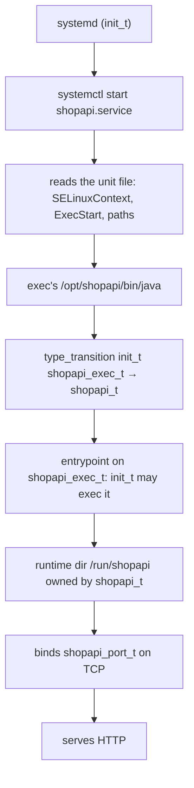

# Designing a Domain

> Every rule you write later is a direct consequence of the boundary you draw today. The trade-off is isolation versus rule volume, and the cost of each side is a review you sign up for.

## The first decision before a rule

Before you write a single `allow`, you decide what the domain is for. That is the single question most developers skip and then spend weeks untangling later. The question is: **does this binary run as `myapp_t` or as `myapp_backend_t`?**

Three answers are real:

| Answer | What it looks like | Typical trigger |
|--------|--------------------|-----------------|
| **One domain per service** | Each long-running binary gets its own domain (`shopapi_t`, `backend_t`, `cron_t`) | per-process trust boundary |
| **One domain per deployment** | All instances of the same service share one domain, but workers split off a second domain | micro-services or multi-process JVMs |
| **One shared domain** | a single `app_t` covers everything, including cron, logrotate, and the worker | simplicity |

The trade-off is not a free choice. Every extra domain you create costs you a review signature on a policy PR. Every rule you add inside it costs you the same signature. But every missing domain you merge costs you a blast radius on compromise.

The recommendation for service authors is the one that matches the privilege of the process it protects. **Each long-running component with a different privilege profile owns its own domain.** That is what `selinux/myapp.te` demonstrates, and it is the answer we land on in §5.

:::: why One domain per service is the default
If every process is one domain, you have a clean blast radius. The same domain, the same allows, the same review. The cost is rule volume: every process you add inherits the rule template, and each gets reviewed once. The alternative, one `unconfined_t` for everything, pays no rule tax and trades all of it in. A compromise of any process becomes a compromise of the host.
::::

## Two ways a process gets into its domain

There are exactly two patterns the repository uses to start a process under its custom domain. Both are shown in `selinux/shopapi/`, and each answers a different reality about how binaries are shipped.

### (a) systemd `SELinuxContext=` sets the domain at exec

The unit names the domain systemd applies when it execs the process:

```bash
$ systemctl show shopapi.service -p SELinuxContext
SELinuxContext=system_u:system_r:shopapi_t:s0
```

`SELinuxContext=` sets the label. It does not make the binary executable. The domain you name still needs `execute` on its entrypoint, which is why the demo never runs `/usr/bin/java`. `demo/shopapi/shopapi.service` runs `/opt/shopapi/bin/java`. That is a private copy of the JRE launcher that `scripts/lib/demo_estate.sh` installs under the application's own root, and `selinux/shopapi/shopapi.fc` labels that path `shopapi_exec_t`. Running the shared `/usr/bin/java` instead gives you `bin_t`. That is a type the forbidden-pattern gate refuses to let a domain execute. Under enforcing, it also gives a `203/EXEC` when no allow covers it.

The pattern is appropriate when the application owns its install root and you want the domain fixed at start time rather than inferred at exec. The review cost is narrow: you sign off the `SELinuxContext=` line and the file context of the entrypoint it runs.

### (b) a labeled entrypoint with `type_transition`

The second pattern puts the label on the binary and lets the kernel move the process into the domain on exec. The shopapi module ships both halves:

- `selinux/shopapi/shopapi.fc` maps the install root, `/opt/shopapi(/.*)?`, to `shopapi_exec_t`.
- `selinux/shopapi/shopapi.te` calls `init_daemon_domain(shopapi_t, shopapi_exec_t)`, which declares the entrypoint and the transition out of the init domain.

The demo uses both patterns at once, and the comment in the unit says so. The private launcher is labeled `shopapi_exec_t` so `shopapi_t` can exec it at all. `SELinuxContext=` then sets the domain without waiting for the transition. The module header calls the labeled entrypoint the *alternative* to `SELinuxContext=` while the `.fc` and `.te` implement it. Read the files, not the header.

The review cost is the same narrow one: you sign off the file context declaration and the `type_transition` line.

## Why the exec type matters

Both (a) and (b) exist for one reason: `bin_t:file execute` is forbidden by this repository's gate. The CI check reads:

```bash
if grep -qE 'allow\s+\w+\s+bin_t:file[[:space:]]+\{[^}]*execute' "${te}"; then
    check_fail "Forbidden bin_t:file execute — label app binaries with dedicated exec types in .fc"
fi
```

`bin_t` is the type of the system's own binaries: `/usr/bin`, `/usr/sbin`, `/usr/libexec`. They are mode `0755`, so world-readable and world-executable, and reachable by nearly every domain on the box. Granting a domain `allow shopapi_t bin_t:file execute` lets that domain exec *every* system binary, from `/usr/sbin/useradd` to `/usr/libexec/platform-python`. That breadth is why the rule is forbidden: every application gets its own `exec_t` declared in the `.fc` file, so `allow shopapi_t shopapi_exec_t:file execute` is legible and scoped.

That is why both start options above end in the same place: an entrypoint the application owns. For a JVM the demo gets there by installing its own launcher. `scripts/lib/demo_estate.sh` copies `/usr/bin/java` into the app root, because a system-wide relabel of the shared launcher is exactly what the gate refuses. With a labeled entrypoint in place you have two choices. You can let `type_transition` from `init_t` move the process, which is what `init_daemon_domain` wires. Or you can set the domain explicitly with `SELinuxContext=`. The demo does both.

## Entry points and the helpers you already know

Every daemon module starts with a pair of macros. They look small, but they each stand for a block of review.

| Macro | Purpose | What it does, and what it does not |
|-------|---------|------------------------------------|
| `init_daemon_domain(domain, exec_type)` | declare the daemon domain, its entrypoint, and the transition from the init domain through that entrypoint | declares the domain/entrypoint relationship and the transition out of the init domain. It does **not** write the daemon's runtime baseline: `files_read_etc_files(<domain>)`, `sysnet_read_config(<domain>)` and the rest are separate lines, which `selinux/myapp.te` collects under its own *Daemon baseline* heading |
| `init_daemon_run_dir(run_type, "name")` | declare the runtime directory the init domain creates for the service | declares the type as the `/run/<name>` home. It does **not** call `files_pid_file()`. Both modules declare that themselves (`selinux/myapp.te` line 22, `selinux/shopapi/shopapi.te` line 26). The domain's own `dir { add_name remove_name write … }` access is written where it is needed |

`init_daemon_domain` is the entry-point and the transition in one line. `init_daemon_run_dir` is the runtime home: systemd creates `/run/<name>`, and the policy knows the type. Both come from the base policy and change with its version. So when a module needs a permission a macro does not emit, the module says so explicitly rather than assuming. Each macro is a block of review. Do not widen one AVC at a time.

Where `selinux/myapp.te` also writes the init-domain side by hand, it declares what that needs:

```text
require {
    type init_t;
    class process { transition dyntransition siginh rlimitinh };
    class file entrypoint;
}
```

It does that because the module starts user units on FCOS, where systemd runs as `init_t`. The comment above those rules says so, and the raw `allow init_t myapp_exec_t:file { … entrypoint }` and `type_transition init_t myapp_exec_t:process myapp_t` follow it. Modules that rely on the macro alone carry no such block: `selinux/shopapi/shopapi.te` and `selinux/payments/payments.te` declare neither `init_t` nor a `require` section.

## Two processes, one application

`selinux/myapp.te` is the reference for the multi-process case. It declares two domains:

```text
type myapp_t;            # Flask application domain
type myapp_backend_t;    # backend stub domain
```

Each domain gets its own `exec_t` (`myapp_exec_t`, `myapp_backend_exec_t`). Each gets its own `domain` declared by `init_daemon_domain`. And each gets its own port (`myapp_port_t`, `myapp_backend_port_t`). They talk to each other through a unix stream socket:

```text
allow myapp_t myapp_backend_t:unix_stream_socket connectto;
```

The Flask process (`myapp_t`) initiates connections into the backend, but the backend cannot reach back into `myapp_t`. That asymmetry is intentional. Each domain has its own exec type, its own entrypoint, its own port and its own baseline allows. `myapp_t` opens HTTP on `myapp_port_t`. `myapp_backend_t` opens its own listener on `myapp_backend_port_t`. What they share is real too: one runtime directory, declared once by `init_daemon_run_dir(myapp_var_run_t, "myapp")`, and one log type. `myapp_backend_t` has no log type and no log allow of its own. The split buys a smaller blast radius on the backend, not a second file tree.

This split is worth it when the backend has a different privilege profile. That means it opens a listener, talks to a database, or has an independent lifecycle. The rule volume is the cost: you get twice the allow list and twice the review signatures. The isolation is the benefit: compromise of the frontend does not automatically compromise the backend.

## systemd hardening and policy surface

A systemd unit already hardens the process before SELinux sees it. `demo/shopapi/shopapi.service` ships with:

```text
NoNewPrivileges=false
StateDirectory=shopapi
LogsDirectory=shopapi
RuntimeDirectory=shopapi
```

`StateDirectory=shopapi`, `LogsDirectory=shopapi` and `RuntimeDirectory=shopapi` are the three paths the manifest names as `var_dir`, `log_dir` and `runtime_dir`. They are also the three paths `selinux/shopapi/shopapi.fc` labels `shopapi_var_lib_t`, `shopapi_log_t` and `shopapi_var_run_t`. The unit creates the directories. The `.fc` gives them their types. The module's allows decide what the domain can do inside them.

Hardening that removes access reduces the policy surface. Read the unit before writing allows. If the unit sets `PrivateTmp` and the app writes state under `/tmp`, your allows will need a broader file class than you expected. If the unit sets `NoNewPrivileges=true`, the kernel refuses the SELinux `type_transition` from `init_t` into your domain on RHEL. The process then stays in the init domain. That is why the shipped unit keeps it `NoNewPrivileges=false` for a labeled daemon. An app that needs `execmem` is a separate security decision: the generator routes it to `needs_review` rather than writing an allow (`docs/examples/fixtures/deterministic/12-execmem-review/`).

::: why Always read the unit
The unit tells the policy what paths exist and what access the process already lost. You write `allow` only for the access the hardening did not remove. A rule you add for access the unit already blocks is extra review.
:::

## Boot-to-domain path

This is the path every daemon follows on RHEL. Each step is a tuple the policy must cover, and each step is a review signature on the module.



::: try
Run these on `rhel-qa` to check that the unit is the unit.
```bash
# The label the unit asked systemd to apply:
$ ps -o label=,args= -C java | head -n 5

# The property on the unit itself:
$ systemctl show shopapi.service -p SELinuxContext

# If you need the file, not the property:
$ systemctl cat shopapi.service | grep SELinuxContext

# The file context on the launcher:
$ ls -Z /opt/shopapi/bin/java
```
:::

## Start options compared

Each start option has a mechanism, a trigger, and a review cost.

| Start option | Mechanism | When to use | What it requires | Review cost |
|-------------|-----------|-------------|------------------|-------------|
| `SELinuxContext=` in systemd | systemd sets the label at exec | you own the install root and want the domain fixed at start time | a labeled entrypoint the domain can exec: `.fc` line plus `restorecon` | sign off the unit line and the entrypoint's file context |
| labeled entrypoint + `type_transition` | `.fc` labels the binary. The policy transitions from `init_t` | the same entrypoint, but you want the kernel to derive the domain | the same file context declaration, plus `init_daemon_domain` | sign off the file type declaration and the transition |
| no domain, `unconfined_t` | nothing: the JVM stays unconfined | first install, before the module lands | none | none, but compromise is a compromise |

The demo uses both at once. That is the honest reading of `selinux/shopapi/` and `demo/shopapi/shopapi.service`. The label on the entrypoint is what makes the exec legal. `SELinuxContext=` is what makes the domain deterministic at start time.

## What you can do now

- decide the boundary: each long-running component with a different privilege profile gets its own domain
- pick the start option: a labeled entrypoint is required either way. `SELinuxContext=` fixes the domain at start time. `type_transition` derives it at exec
- use `init_daemon_domain` and `init_daemon_run_dir` as the two entry-point blocks that stand for the review
- read the systemd unit before writing allows: hardening removes access, and the policy only covers what the unit kept
- check the unit with `systemctl show <unit> -p SELinuxContext`, `systemctl cat <unit>` and `ls -Z /opt/<app>/bin/<launcher>`
- treat each `init_daemon_domain` block as one review signature, not a per-allow expansion
