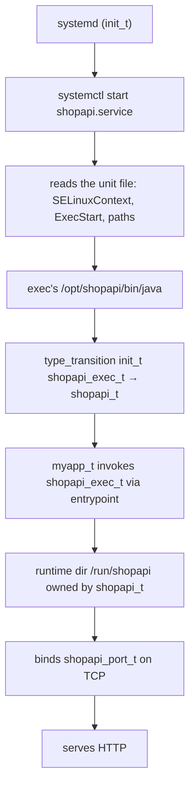

# Designing a Domain

> Every rule you write later is a direct consequence of the boundary you draw today. The trade-off is isolation versus rule volume, and the cost of each side is a review you sign up for.

## The first decision before a rule

Before you write a single `allow`, you decide what the domain is for. That is the single question most developers skip and then spend weeks untangling later. The question is: **does this binary run as `myapp_t` or as `myapp_backend_t`?**

Three answers are real:

| Answer | What it looks like | Typical trigger |
|--------|--------------------|-----------------|
| **One domain per service** | Each long-running binary gets its own domain (`shopapi_t`, `backend_t`, `cron_t`) | per-process trust boundary |
| **One domain per deployment** | All instances of the same service share one domain, but workers split off a second domain | micro-services or multi-process JVMs |
| **One shared domain** | a single `app_t` covers everything, including cron, logrotate, and the worker | simplicity |

The trade-off is not a free choice. Every extra domain you create costs you a review signature on a policy PR, and every rule you add inside it costs you the same signature. But every missing domain you merge costs you a blast radius on compromise.

The recommendation for service authors is the one that matches the privilege of the process it protects: **each long-running component with a different privilege profile owns its own domain.** That is what `selinux/myapp.te` demonstrates, and it is the answer we land on in §5.

:::: why One domain per service is the default
If every process is one domain, you have a clean blast radius. The same domain, the same allows, the same review. The cost is rule volume — every process you add inherits the rule template, and each gets reviewed once. The alternative — one `unconfined_t` for everything — pays no rule tax and trades all of it in: a compromise of any process becomes a compromise of the host.
::::

## Two ways a process gets into its domain

There are exactly two patterns the repository uses to start a process under its custom domain. Both are shown in `selinux/shopapi/`, and each answers a different reality about how binaries are shipped.

### (a) systemd `SELinuxContext=` on a shared binary

The systemd unit carries the label directly:

```bash
$ systemctl cat shopapi.service | grep SELinuxContext
SELinuxContext=system_u:system_r:shopapi_t:s0
```

`shopapi.service` sets `SELinuxContext=system_u:system_r:shopapi_t:s0` because the JVM launcher is `bin_t` — a shared binary every host trusts, and therefore every host unconfined. Under enforcing, that binary would refuse to exec into a label. systemd is the only way to force the transition without a wrapper.

This pattern is appropriate whenever the binary is `bin_t` or `java_exec_t` from the base policy and you need it to run under a custom domain. The review cost is narrow: you sign off that systemd is allowed to exec the entrypoint, and the policy covers the runtime.

### (b) a labelled wrapper with `type_transition`

The alternative is to place a new label on the binary itself. The shopapi template does not take this path in the first PR — the header of `selinux/shopapi/shopapi.te` lists it explicitly:

> *Live start: systemd `SELinuxContext=system_u:system_r:shopapi_t:s0` (java is a shared `bin_t`/`java_exec_t` binary). Alternative: labelled wrapper at the app `install_root` labeled `shopapi_exec_t` + `type_transition`.*

The wrapper pattern is appropriate when you can relabel the binary at the install root — for example, when the binary is delivered into your own path under `/opt/shopapi/bin/java` and you own the file contexts. The review cost is the same narrow one: you sign off the file context declaration, and `type_transition` is covered in §3 below.

## Why the exec type matters

Both (a) and (b) exist for one reason: `bin_t:file execute` is forbidden by this repository's gate. The CI check reads:

```bash
if grep -qE 'allow\s+\w+\s+bin_t:file[[:space:]]+\{[^}]*execute' "${te}"; then
    check_fail "Forbidden bin_t:file execute — label app binaries with dedicated exec types in .fc"
fi
```

A `bin_t` file is a world-writable, world-executable binary that every host trusts. Granting a domain `allow shopapi_t bin_t:file execute` lets that domain exec *every* binary on the box, including `/usr/sbin/useradd` or `/usr/libexec/platform-python`. That is exactly why the rule is forbidden: every application needs its own `exec_t` type declared in the `.fc` file, so `allow shopapi_t shopapi_exec_t:file execute` is legible and scoped.

That is why each start option above exists. You either:

1. force the transition from `init_t` via `SELinuxContext=` in systemd, accepting that `init_t` already trusts the `bin_t` exec, or
2. relabel the binary with a dedicated `exec_t`, letting `type_transition` from `init_t` do the work cleanly.

In practice the first answer is cheaper for JVMs because nobody wants to relabel the JRE launcher on every host.

## Entry points and the helpers you already know

Every daemon module starts with a pair of macros. They look small, but they each stand for a block of review.

| Macro | Purpose | What it expands to |
|-------|---------|--------------------|
| `init_daemon_domain(domain, exec_type)` | declare baseline allows for a daemon process starting from a file of the given exec type | `allow init_t <exec_type>:file { execute read open getattr map ioctl execute_no_trans entrypoint }; allow <domain> <exec_type>:file entrypoint; type_transition init_t <exec_type>:process <domain>;` — and baseline macros such as `files_read_etc_files(<domain>)` |
| `init_daemon_run_dir(run_type, "name")` | declare a runtime directory owned by the domain | `allow init_t <run_type>:dir { search getattr }; allow <domain> <run_type>:dir { add_name remove_name write search getattr open read }; files_pid_file(<run_type>)` |

`init_daemon_domain` is the entry-point. It declares the relationship between `init_t` (systemd) and the exec file, the domain and the exec file, and `type_transition` from `init_t` into the domain. `init_daemon_run_dir` is the runtime home: systemd creates `/run/<name>`, the domain owns it, the pid file lives there. Each macro is a block of allow and each block must be reviewed as one unit; do not widen one AVC at a time.

The `require` block in `selinux/myapp.te` is the mechanical glue that lets these macros work:

```text
require {
    type init_t;
    class process { transition dyntransition siginh rlimitinh };
    class file entrypoint;
}
```

Every module that uses `init_daemon_domain` or `type_transition` against `init_t` needs this block. It names the types, classes and permissions that the macros will reach for.

## Two processes, one application

`selinux/myapp.te` is the reference for the multi-process case. It declares two domains:

```text
type myapp_t;            # Flask application domain
type myapp_backend_t;    # backend stub domain
```

Each domain gets its own `exec_t` (`myapp_exec_t`, `myapp_backend_exec_t`), each its own `domain` declared by `init_daemon_domain`, and each its own port (`myapp_port_t`, `myapp_backend_port_t`). They talk to each other through a unix stream socket:

```text
allow myapp_t myapp_backend_t:unix_stream_socket connectto;
```

The Flask process (`myapp_t`) initiates connections into the backend, but the backend cannot reach back into `myapp_t` — that asymmetry is intentional. Each domain has a different privilege profile: `myapp_t` opens HTTP on `myapp_port_t`; `myapp_backend_t` opens its own listener on `myapp_backend_port_t`. Each owns its own runtime dir; each can write its own log files; each has its own baseline allows.

This split is worth it when the backend has a different privilege profile — when it opens a listener, talks to a database, or has an independent lifecycle. The rule volume is the cost: you get twice the allow list and twice the review signatures. The isolation is the benefit: compromise of the frontend does not automatically compromise the backend.

## systemd hardening and policy surface

A systemd unit already hardens the process before SELinux sees it. `selinux/shopapi/shopapi.service` ships with:

```text
NoNewPrivileges=false
StateDirectory=shopapi
LogsDirectory=shopapi
RuntimeDirectory=shopapi
```

`StateDirectory` and `LogsDirectory` translate directly into `shopapi_var_lib_t` and `shopapi_log_t` on disk, each owned by the domain. `RuntimeDirectory=shopapi` translates into `shopapi_var_run_t`. Each of these is the reason the policy has the permissive path to the file; each is the reason the policy names the type.

Hardening that removes access reduces the policy surface. Read the unit before writing allows. If the unit says `PrivateTmp` and the app writes state under `/tmp`, your allows will need a broader file class than you expected. If the unit says `NoNewPrivileges` and the process needs `execmem`, your baseline already refuses.

::: why Always read the unit
The unit tells the policy what paths exist and what access the process already lost. You write `allow` only for the access the hardening did not remove. Every rule you add that the unit would already grant is extra review.
:::

## Boot-to-domain path

This is the path every daemon follows on RHEL. Each step is a tuple the policy must cover, and each step is a review signature on the module.



::: try
Run these on `rhel-qa` to verify the unit is the unit.
```bash
# The label the unit asked systemd to apply:
$ ps -o label=,args= -C java | head -n 5

# The property on the unit itself:
$ systemctl show shopapi.service -p SELinuxContext

# If you need the file, not the property:
$ systemctl cat shopapi.service | grep SELinuxContext

# The file context on the launcher:
$ ls -Z /opt/shopapi/bin/java
```
:::

## Start options compared

Each start option has a mechanism, a trigger, and a review cost.

| Start option | Mechanism | When to use | What it requires | Review cost |
|-------------|-----------|-------------|------------------|-------------|
| `SELinuxContext=` in systemd | systemd forces the label on exec | shared `bin_t`/`java_exec_t` binaries | no `.fc` change on the binary | sign off `init_t` entrypoint allows only |
| labelled wrapper + `type_transition` | `.fc` relabels the binary; the policy `type_transition` from `init_t` | own path under `/opt`, JRE or wrapper you control | file context declaration for the new type, plus `restorecon` step | sign off the file type declaration and `type_transition` line |
| no domain, `unconfined_t` | nothing — the JVM stays unconfined | first install before the module lands | none | none, but compromise is a compromise |

The repo prefers the systemd option for the JVM because nobody wants to relabel the JRE launcher. The alternative stays available and is documented in the template header.

## What you can do now

- decide the boundary: each long-running component with a different privilege profile gets its own domain
- pick the start option: `SELinuxContext=` for shared binaries, labelled wrapper for your own paths
- use `init_daemon_domain` and `init_daemon_run_dir` as the two entry-point blocks that stand for the review
- read the systemd unit before writing allows — hardening removes access, the policy only covers what the unit kept
- verify the unit with `systemctl show <unit> -p SELinuxContext`, `systemctl cat <unit>` and `ls -Z /opt/<app>/bin/<launcher>`
- treat each `init_daemon_domain` block as one review signature, not a per-allow expansion
