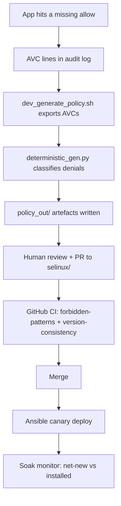

# From Denial to Pull Request

> Every denial you see in `audit.log` is the answer to one tuple of four values. This chapter turns those answers into a reviewed diff — on your laptop, without a production host — so that the only thing that ever touches a live box is the pull request your team has already approved.

## The loop, in nine steps

Every SELinux policy change on a real fleet follows the same nine-step sequence. The developer does the first seven; the admin owns the last two; the CI pipeline owns the middle. Nothing skips the review step.



Numbered:

1. Deploy the application on `rhel-qa` with a types-only seed module — no allow rules yet, just domains and labels.
2. Switch that domain to permissive (`semanage permissive -a shopapi_t`). The kernel keeps logging every denied tuple, but each one lets the operation proceed.
3. Exercise the application through the documented test suite — for `shopapi` that is `curl /health /state /log /feature-spool` on :8091.
4. Export AVCs with `scripts/dev_generate_policy.sh` (or the explicit `bash scripts/dev_generate_policy.sh --skip-export` form that operates on a pre-existing `policy_out/avc.log`).
5. Run `cli/deterministic_gen.py` against the AVC log, the manifest, and the committed `.te` / `.fc`. The script writes `policy_out/{app}.te`, `policy_out/{app}.fc`, `policy_out/pr_summary.md`, and `policy_out/findings.json`.
6. Inspect the diff against `selinux/`. If every verdict passes and the access delta looks like the AVC lines, open the PR.
7. The PR body (assembled by `scripts/assemble_pr_body.sh` from `.github/PULL_REQUEST_TEMPLATE/selinux_policy_review.md`, the generated summary, and the AVC log excerpt) carries the evidence for the reviewer.
8. CI runs `forbidden-patterns` (via `scripts/validate_forbidden_patterns.sh`) and `version-consistency`; the generator already ran the same forbidden-pattern check, so those jobs should be green.
9. CODEOWNERS review — the generator is not a reviewer; you still have to read each rule.

Everything below happens before step 9. Compile and validate on `rhel-qa`; production is Part IV.

## The generator at each stage

The default engine is `cli/deterministic_gen.py`. It does not call an LLM and it does not consult a network API; each verdict is reproduced from the same inputs.

```mermaid
flowchart TD
  A[avc.log] --> B[parse: extract domains, classes, permissions]
  B --> C[merge: (src_type, tgt_type, tclass) union perms]
  C --> D[subtract: existing .te allows]
  D --> E[net-new access needs]
  E --> F[classify each need: verdict]
  F --> G[render fragment per verdict]
  G --> H[write .te / .fc / pr_summary.md / findings.json]
```

Each phase is a single responsibility.

| Stage | What it does | Where the code lives |
|---|---|---|
| **Preprocess** | Extracts source and target types from `scontext`/`tcontext`, parses `denied { ... }` permission sets, merges duplicate AVC lines by tuple, subtracts permissions already covered by the existing `.te`. | `cli/avc_preprocess.py` — `merge_avc_entries`, `subtract_covered`. |
| **Parse AVC file** | Reads each line, filters by manifest domains, pulls `path="…"` entries into a per-tuple path map and `src=N` entries into a per-tuple port map for `name_bind`. | `cli/deterministic_gen.py` — `parse_avc_file`. |
| **Classify** | For each net-new need the generator picks a verdict: `fc_fix`, `fc_drift`, `private_port`, `forbidden`, `baseline`, `interface`, `direct`, `toolchain_required`, `boolean`, or `needs_review`. The verdict decides whether to emit an allow rule, a refpolicy macro, a `.fc` line, a `setsebool` command, or to block generation. | `cli/deterministic_gen.py` — `classify` (lines 335–615). |
| **Render fragment** | Assembles the `.te` body: baseline macro lines and `fc_drift` notes are kept as comments, interfaces and direct allows are emitted as prose `allow` rules, port rules as `allow` lines. | `cli/deterministic_gen.py` — `render_fragment`. |
| **Merge** | Splices the fragment into the existing `.te` (updating the `policy_module(name, version)` line with `merge_te`), and overlays `.fc` lines via `merge_fc`. | `cli/deterministic_gen.py` — `merge_te`, `merge_fc`, `filter_fc_fix_lines` in `cli/fc_labeling.py`. |
| **Summarise** | Writes `pr_summary.md`: policy summary, network bindings, file system access, explicit denials maintained, classification audit table per verdict. | `cli/deterministic_gen.py` — `write_pr_summary`. |
| **Assemble PR** | Folds `pr_summary.md`, the AVC log excerpt, and the merged-base `sesearch` diff into `policy_out/pr_body.md` via the PR template. | `scripts/assemble_pr_body.sh`. |
| **Verify** | Re-checks the generated `.te` against the AVC log: every AVC line must trace to a rule or a labeling fix. | `cli/verify_avc_coverage.py`. |

What the generator deliberately does not do:

- It never touches a production host. Not `semanage`, not `semodule`, not a policy load. The compiled `.pp` is produced only by `scripts/compile_and_validate.sh` on `rhel-qa`.
- It never rewrites a baseline allow it cannot explain. If a tuple is already covered by the existing `.te`, the verdict is `baseline` and nothing changes.
- It never emits a `forbidden` verdict as an allow. `shadow_t`, `unconfined_t`, and `sysadm_t` are on the blocked list (`cli/policy_rules.py`). Without `--force` and a recorded reason, a base-type allow that also collides with vendor policy does not land in the PR.
- It never calls an LLM for the rule text. The deterministic engine is all Python, all rules. The optional LLM path only polishes prose.

Where the operator must run afterwards: compile and validate on `rhel-qa` (`sudo dnf install -y selinux-policy-devel setools-console`, then `bash scripts/compile_and_validate.sh selinux`). Production is Part IV — canary, soak, enforce, rollback.

## The two engines

| Switch | Engine | What it touches | When you need it |
|---|---|---|---|
| (none) | `cli/deterministic_gen.py` | `.te`/`.fc` only; all Python, no API | Default; CI tests this. |
| `--llm-summary` | `cli/deterministic_gen.py` + `cli/summarize_pr.py` | prose only; the `.te`/`.fc` are identical to above | Optional admin narrative in `pr_summary.md`. |
| `--legacy-full-policy` (deprecated) | `cli/selinux_gen.py` | `.te`/`.fc` **and** narrative | Legacy; still available. |

The full LLM path lives in `cli/selinux_gen.py` and is opt-in. Its help text reads:

```text
--legacy-full-policy        Deprecated: LLM generates full .te/.fc
                            (use dev_generate_policy.sh + summarize_pr.py)
```

The script still refuses `--legacy-full-policy` unless the operator accepts a recorded deviation:

```text
"  Summary: python3 cli/summarize_pr.py         (optional LLM prose)
"  Or pass --legacy-full-policy to run the old all-in-one LLM path."
```

Every run of the LLM path requires `OPENAI_API_KEY` (or `OPENAI_BASE_URL` / `OPENAI_API_MODEL` for a LiteLLM endpoint). The policy text, the classifier, and the forbidden list are identical to the deterministic path; only the closing summary is generated by the model.

## Evidence discipline

The PR body must carry enough evidence for a reviewer to read each rule and re-read the AVC line that asked for it. The template under `.github/PULL_REQUEST_TEMPLATE/selinux_policy_review.md` prescribes the sections that assemble into `policy_out/pr_body.md`. Each section is a claim you can verify.

The `pr_body.example.md` fixture in `docs/examples/pr_body.example.md` shows the shape the assembler produces:

```markdown
### 1. Application Context
- **App Name / Service:** `myapp` (Order Processor)
- **Target Domain:** `myapp_t`
- **Policy Version:** 1.1.2
- **Staging Environment Tested:** selinux-staging
- **Test Suite Run:** … endpoints + `wait_for_endpoints.sh` (manifest-driven domain context)
- **AVC Log Lines Collected:** 312

### 2. Policy summary (Plain English for Admins)
…

### 2.5 Policy access delta (merge-base)
**Rules ADDED** (app domains, excerpt):
```text
allow myapp_t myapp_log_t:file { append create open write };
```

### 4. AVC Evidence (sample lines from staging)
```text
type=AVC msg=audit(1730000001.101:501): avc: denied { name_bind } …
type=AVC msg=audit(1730000002.102:502): avc: denied { append create open write } …
```

### 5. Developer Self-Attestation (App Team)
- [x] Integration tests passed with `myapp_t` in **permissive** mode
- [x] AVC denials collected only from trusted automated test execution
- [x] `bash scripts/dev_generate_policy.sh --apply` or equivalent CLI run completed
- [x] No wildcard allows (`allow myapp_t *:*`) or high-privilege domains in `.te`
```text

Every allow rule in the final diff must correspond to an AVC line the log contains, or to a labeling fix the `.fc` carries. If a reviewer opens `policy_out/pr_body.md` and reads section 4, every rule in section 2.5 should trace back to one of those lines. That is why the assembler pulls an AVC excerpt — not as decoration, but as the access delta that pairs with the generated rule.

## The human gate

Two gates catch the generator before it ships:

1. **CI `forbidden-patterns`.** `scripts/validate_forbidden_patterns.sh` runs as a GitHub workflow (`.github/workflows/selinux-policy-ci.yml`). It scans `selinux/*.te` for the same forbidden-target list that the generator carries in `cli/policy_rules.py`: `shadow_t`, `unconfined_t`, `sysadm_t`, and wildcard allows. The generator already ran that check — the same script — so the CI job should be green without surprise failures.
2. **CODEOWNERS review.** The PR template labels every submission `security`, `selinux`, `pending-admin-review`. The generator classifies denials; the reviewer classifies trust. A rule that names a private type under the application directory is a green signal; a rule that names a system type is a yellow signal regardless of how many AVC lines produced it.

The generator is not a reviewer. `VERDICT_NEEDS_REVIEW` means the tuple is legitimate but the allow would weaken the domain (`execmem`, `dac_override`, or a foreign `process` transition). It is recorded in `findings.json` and listed in `pr_summary.md` as a security decision, not a labeling miss. It is not written to the `.te` unless `--allow-needs-review` is passed with at least one explicit `--allow-needs-review-perm`. That switch is the developer saying: "this AVC proved the rule; I accept the weakening."

`VERDICT_TOOLCHAIN_REQUIRED` blocks generation entirely. The generator refuses a silent raw allow on a base type when `sesearch` cannot confirm a boolean, and `sepolgen` cannot confirm a refpolicy interface. The banner printed on stderr reads:

```
SEPOLGEN INTERFACE MATCHING IS NOT AVAILABLE

Install setools-console, ensure policy is loaded, run sepolgen-ifgen,
or pass --allow-degraded (not recommended).
```text

`--allow-degraded` records each raw allow as `engine=degraded` in `findings.json`; the admin reviewer must treat those rows as `audit2allow` output, not interface-backed policy.

## `::: why` why the loop is built this way

If the generator compiled directly and loaded the module on `rhel-prod`, the next stage would be a canary with no soak. If the operator skipped the PR body and ran `semodule -i` from `policy_out/`, the next stage would be a denial response — and chapter 20 handles the 02:00 card. The loop is built so the most dangerous decision (loading a new allow on a live host) is never the same decision that generated the rule. The developer generates a reviewed diff; the admin loads it through a canary. That separation is what the loop buys you.

## `::: try` run the generator locally

This works on a laptop with no SELinux — it only needs Python 3. The inputs are real fixture files from the repository.

```bash
cd selinux-pac

# (optional) pull the manifest-driven dependencies the CLI uses.
make deps

# One command: explain mode, against the mislabeled-var-lib fixture.
python3 cli/deterministic_gen.py --explain \
  --avc-log docs/examples/fixtures/deterministic/01-mislabeled-var-lib/avc.log \
  --manifest config/myapp.manifest.yml \
  --existing-te selinux/myapp.te \
  --existing-fc selinux/myapp.fc
```

Expected output (verbatim from the golden fixture `docs/examples/fixtures/deterministic/01-mislabeled-var-lib/expected.json`):

```text
[   fc_drift] myapp_t → var_lib_t:file { write }
               /var/lib/myapp/data.log should already be myapp_var_lib_t per the .fc,
               but is labeled var_lib_t on disk. No policy change needed — run:
               restorecon -Rv /var/lib/myapp/data.log
```

A green exit with no blockers and the verdict `fc_drift` confirms the fixture passes every check — the generator refused to allow a generic type, asked for a `restorecon`, and wrote the rule as a comment in `findings.json`.

To go further and assemble a PR body against this fixture:

```bash
bash scripts/dev_generate_policy.sh \
  --skip-export \
  --app-name myapp \
  --out-dir policy_out \
  --staging-host laptop-local \
  --test-suite "deterministic fixture 01"
```

This writes `policy_out/pr_body.md` and leaves `selinux/` untouched — exactly what the chapter promises: nothing touches production.

## What you can do now

- Read every AVC denial in the log as four values that map directly to a rule.
- Run `cli/deterministic_gen.py --explain` against one fixture and recognise the verdicts each one produces.
- Tell the difference between `fc_drift` (label fix, no rule) and `needs_review` (security decision, rule).
- Inspect `policy_out/pr_body.md` and verify each rule in section 2.5 traces to a line in section 4.
- Open a PR from `policy_out/` to `selinux/` knowing that `rhel-qa` does the next two steps (compile and semantics) and that CODEOWNERS still must read the diff.
