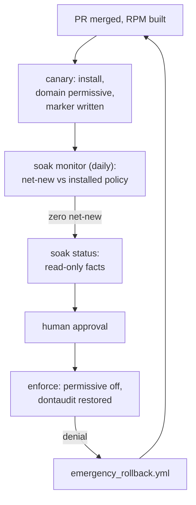

# Canary, Soak, Enforce

> Three promotions take a reviewed module from "installed" to "enforcing". Each one changes
> something specific on the host, each one is reversible on its own, and none of them touches the
> host's enforcing mode. This chapter is what happens after the pull request merges.

## What each stage changes on the host

| Stage | Playbook | What changes | What must be true to proceed |
|---|---|---|---|
| **Release canary** | `ansible/deploy_canary.yml` | the module installs; **one** domain joins the permissive list; port labels are registered; the soak clock starts | the RPM (or a staged `.pp`) exists, and the app answers its probes |
| **Soak monitor** | `ansible/soak_monitor.yml` (scheduled) | nothing — it reads | net-new access against the **installed** policy is zero, and `sesearch` is available |
| **Promote to enforce** | `ansible/enforce_production.yml` | the domain leaves the permissive list; `dontaudit` is restored; services restart under enforcement | soak facts pass, the change ticket is present, and a human approved |



Two properties hold for all three stages: `getenforce` reports **Enforcing** on the host at every
point, and each stage is a playbook that either passes or fails closed.

## Canary: install, restrict, probe, timestamp

`deploy_canary.yml` runs with `serial: 1`, so one host finishes the whole sequence before the next
one starts. That is what makes a canary a canary: the blast radius of a bad module is one host,
and the operator sees the first host's result before the fleet moves.

The role's `canary.yml` does these things in order, and every one of them is a task you can read:

1. **Disable `dontaudit` for the soak window** — a host-wide change, so that a denial which policy
   deliberately kept quiet cannot hide from the soak.
2. **Register port labels** — from the committed manifest; the packaged CIL is preferred and the
   manifest is templated when it is absent. Ports come from git, not from someone typing
   `semanage port` on the host.
3. **Make one domain permissive** — `semanage permissive -a <domain>` for the application's own
   domain only. The host stays enforcing; the application logs instead of blocking.
4. **Label and verify paths** — ensure the application directories exist, `restorecon` them, and
   then *verify* the contexts before any service restarts.
5. **Record the clock** — write the canary timestamp to the soak marker (`soak_marker_file`,
   by default `<var_dir>/selinux_canary_deployed_at`). This runs *before* the restart on purpose:
   the marker is the left edge of the AVC window that step 7 reads, so the restart's own denials
   are inside it.
6. **Restart and probe** — reset the systemd failure counters, restart the application services,
   `restorecon` the runtime directory, then run the unified endpoint smoke:
   `wait_for_endpoints.sh` against the manifest's endpoints, probing `http_probe_host` from the
   retry window baked into the task (`--retries 15 --delay 2`). Lengthening that window today
   means editing `ansible/roles/selinux_pac/tasks/canary.yml`, not the inventory.
7. **Read the fresh window** — `monitor_avc.sh --marker-file <that marker>` prints the raw and
   net-new counts for everything since the clock started; thresholds are `canary_max_avc` and
   `canary_max_net_new`, and exceeding either drops the block into its `rescue` (`semodule -B`,
   then a failed run).
8. **Write the report** — `post_deploy_report.sh --phase canary` produces the deploy report at
   `<var_dir>/selinux_deploy_report.json`, the artifact the soak gate later reads.

The marker is the anchor for everything that follows: `ausearch` windows, `days_elapsed`, and the
"what changed since canary" question at 02:00.

::: why The permissive list is the whole trick
SELinux's enforcing mode is a property of the host; the permissive list is a property of one
domain. Moving a domain on and off that list is a small, auditable, reversible operation that
needs no reboot, no relabel and no maintenance window. Everything else in this chapter is
bookkeeping around those two commands.
:::

## Soak: evidence rather than elapsed time

`soak_monitor.yml` runs on a schedule — in AAP it is a scheduled job template, not a wait node in
a workflow — and it answers one question: **has the application reached for anything the installed
policy does not already allow, since the canary started?**

That is not the same question as "were there AVC lines". Duplicate denials from a known,
accepted tuple are noise; a first-time access need is a finding. The monitor gets there by
running `monitor_avc.sh` with the manifest, the marker file, and two thresholds:

```text
{{ selinux_ops_dir }}/monitor_avc.sh \
  --manifest {{ app_manifest_path }} \
  --marker-file {{ soak_marker_file }} \
  --max-avc {{ soak_max_avc | default(0) }} \
  --max-net-new {{ soak_max_net_new | default(0) }} \
  --show-lines {{ soak_show_lines | default(5) }} \
  --fail-dir {{ var_dir }} \
  --format json
```

The role's defaults are strict on purpose: `soak_max_avc: 0`, `soak_max_net_new: 0`,
`soak_use_net_new: true`, `soak_min_days: 7`. A default of zero means the gate is a statement, not
a tolerance.

Two failure paths matter more than the happy one:

- **`sesearch` missing.** Net-new classification needs the installed policy. `require_sesearch.yml`
  resolves `sesearch` and fails the run when it cannot, and `soak_monitor.yml` refuses the raw-AVC
  fallback explicitly. A soak that cannot classify is not a passing soak — `setools-console` is a
  package requirement of the ops RPM for exactly this reason.
- **A net-new line.** The monitor exits non-zero, the host stays permissive, and the fix is a pull
  request: export the new AVCs, generate, review, package, canary again. The soak clock restarts,
  because the policy changed.

## Enforce: the gate, the ticket, and the escape hatch

`enforce_production.yml` is where the operator is asked to be accountable. It runs, in order:

| Task | What it refuses |
|---|---|
| Require change ticket for enforce | an empty `change_ticket` — every enforce carries a ticket id |
| Refuse lab soak window on production group | `soak_min_days` below 7 on a host in the `production` group |
| Collect and parse soak gate facts | the target host's marker, AVC counts, net-new count, deploy report |
| Fail when canary marker missing | enforcing a host that never ran a canary |
| Fail when soak period not met | a window shorter than the minimum |
| Fail when net-new count too high / raw AVCs too high | unreviewed access |
| Fail when the deploy report gate is not satisfied | attestation that was never recorded |
| Re-enable `dontaudit` baseline | leaving the host with `dontaudit` disabled |
| Remove the permissive flag from the domain | — this is the promotion itself |
| Verify SELinux enforcing mode | a host that is not enforcing |
| Restore contexts, verify, restart services | a service running on drifted labels |

`force_enforce` is the break-glass switch, and it still requires the ticket. Its purpose is a
soak window that has not finished while the change window closes — not a missing canary, not a
missing report, and not an unattended deploy. The AAP survey makes that explicit: `change_ticket`
is `required: true`, and the `force_enforce` question defaults to `false` with the description
"Leave false."

::: warn `soak_min_days: 0` is lab-only; `force_enforce` still needs a change ticket
`ansible/inventory.dev.example.yml` sets `soak_min_days: 0` so a two-hour lab can finish; the
production guard above refuses that value on any host in the `production` group. `force_enforce=true`
skips the soak gates and keeps the ticket check — it is a recorded decision, not a bypass of the
change process.
:::

## AAP: the workflow that chains them

The controller objects mirror the three stages, plus rollback:

| Object | Type | Purpose |
|---|---|---|
| SELinux – Canary | job template | install the module, one domain permissive, start the clock |
| SELinux – Soak monitor | job template, **scheduled** | the daily net-new check |
| SELinux – Soak status | job template | read-only facts for a human |
| SELinux – Enforce | job template, required survey | the promotion |
| SELinux – Rollback | job template | permissive relief and optional RPM downgrade |

Two workflows use them: **Release canary** (one job) and **Promote to enforce**
(soak status → approval node → enforce). Soak monitoring stays a schedule, because a workflow that
waits seven days is a workflow nobody can audit.

The same playbooks run from a laptop before AAP exists — which is how you rehearse this chapter:

::: try Read the soak status without changing anything
On the controller, with the production inventory written by
`bash scripts/setup_rhel_hosts.sh write --qa-host … --prod-host …`:

```bash
ansible-playbook -i ansible/inventory.production.yml ansible/soak_status.yml --limit canary
```

`soak_status.yml` runs `collect_soak_facts.sh` and prints days elapsed, raw AVCs since the marker,
net-new count with its `fail_closed` flag, and the deploy report gate. Nothing on the host changes.

The canary has no useful `--check` mode: half of its tasks are `command`/`shell`, Ansible skips
those in check mode, and the very next task parses their `stdout` — so `--check` ends in the
block's `rescue` with `Canary deploy failed`. To review the plan without touching a host, use
`ansible-playbook -i ansible/inventory.dev.yml ansible/deploy_canary.yml --list-tasks`; to
exercise it, run it for real against a lab inventory.
:::

## How to read a soak result

| What you see | What it means | What you do |
|---|---|---|
| `Net-new access needs: 0`, `fail_closed=False` | the policy covers what the traffic asked for | nothing; the gate is evidence for the change ticket |
| `Net-new access needs: 3` | three tuples the installed policy does not allow | export the AVCs, open a PR, canary again |
| `fail_closed=True` | `sesearch` was unavailable, so nothing could be classified | install `setools-console` (or fix `PATH`) and re-run; do not read this as a pass |
| `Days elapsed: 4 / min 7` | the window has not closed | wait, or use `force_enforce` with a ticket and a reason |
| `Marker: False` | the host never ran a canary | enforce will refuse; run the canary |
| A denial in the canary's own recent-window check | the application broke during deploy | fix forward or roll back; the soak has not started meaningfully |

## What you can do now

- **Describe** the three promotions precisely: canary installs and makes one domain permissive,
  soak watches net-new access, enforce removes the permissive flag.
- **Read** a soak result and act on it: zero is a pass, a net-new line is a pull request, a
  missing `sesearch` is a failure rather than a warning.
- **Run** the read-only status playbook on the controller and name the stage the host is in
  without touching it.
- **Explain** to a change board what `force_enforce` does and does not skip, and why the change
  ticket is not optional.
