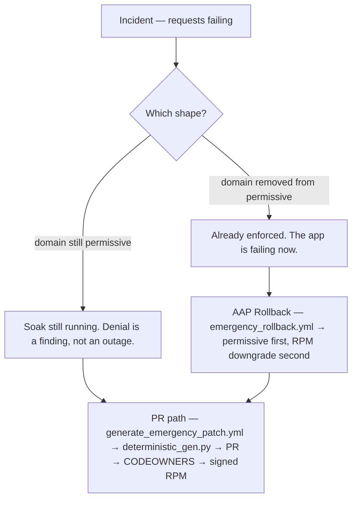

# Incidents: the 02:00 Card

> When `audit.log` starts writing the wrong answer, you have sixty seconds to remember the two shapes.

You are on the bridge. The app team calls: requests are failing, the dashboard is paging you. One of two things is true about the host right now. Get it right in the first minute, and the rest of the hour is easy. Get it wrong, and the outage deepens.

Every incident under this chapter is about one decision: is the domain **still permissive**, or is it **already enforcing**? That single fact routes every command, every playbook, and every call to the app team.

The rules are the same as the whole book (§2, §6): the OS stays **Enforcing**; only the application's own domain is ever made permissive; production is never mutated by hand.



## Shape A — the denial while the domain is still permissive

The service kept running. The denial is a **soak finding** — a net-new access need that slipped past the gate. This is the better shape: the OS still enforcing, the app still answering, and the wrong answer is a PR, not a hotfix.

`soak_monitor.yml` flags **net-new** access needs on the canary group. A finding does not cancel — the domain is still on the permissive list because the canary was supposed to surface exactly this. The operator does not go to the box. The operator pulls the AVCs, the controller generates, a CODEOWNER reviews, and the RPM ships.

The app team's panic in this shape is the wrong one: it is the expectation of a fix this hour. The answer you give is the expectation of a fix this week — with a canary clock that resets on deploy.

### The shape A decision table

| Symptom | First check | Decision | Who decides | What must never be done |
|---|---|---|---|---|
| Service responding, AVC in audit.log — domain permissive | `getenforce` → Enforcing; `semanage permissive -l` → domain still listed; `ausearch -m avc -ts recent` → denials but no outage | Soak still running. Denial is a finding, not an outage. | SELinux admin, with the change-ticket owner's sign-off on the PR | `setenforce 0` on the host — whole-OS permissive |
| `soak_monitor.yml` ran daily, flagged net-new count | `soak_status.yml` or AAP **SELinux – Soak monitor** job status; the deploy report at `/var/lib/myapp/selinux_deploy_report.json` | Net-new count over threshold (`soak_use_net_new` still on); gate is informational, not blocking | Same as the first row | `audit2allow | semodule -i` on production |
| Application still accepting traffic | `semanage permissive -l` still contains the domain; AVCs present but the path is reachable | PR path: generate from the AVCs, CODEOWNER review, signed RPM, re-canary | SELinux admin owns the PR; the change-ticket owner approves the PR | Editing `/etc/selinux/config` — persistent OS state change |

### The read-only reconnaissance set

These four commands, in this order, tell you which shape you are in — every command is read-only:

```bash
# 1. Host-wide mode. Enforcing is the answer.
getenforce

# 2. Permissive domains. Zero names means everything enforcing.
semanage permissive -l

# 3. Recent AVCs. Names the denied tuple.
ausearch -m avc -ts recent 2>/dev/null || grep -E '^(type=AVC|type=SELINUX_ERR)' /var/log/audit/audit.log

# 4. Soak status — marker file and AAP record.
ls /var/lib/myapp/selinux_canary_deployed_at   # exists → soak running; the clock is counting
ansible-playbook -i ansible/inventory.production.yml ansible/soak_status.yml --limit canary  # playbook-level state
```

`getenforce` is Enforcing throughout soak. Only `myapp_t` is permissive. That is the two-layer reminder in §3.5 of the production readiness guide. If `semanage permissive -l` returns empty, you are in shape B. If it returns your domain name, you are in shape A.

## Shape B — already enforcing, the app is failing now

This is the outage. The permissive domain is gone, the policy is running its full decision, and the denial is blocking a live path. You roll back first.

The playbook is [`repo:ansible/emergency_rollback.yml`](ansible/emergency_rollback.yml). It is the AAP template **SELinux – Rollback**. It is the operator's emergency card. It does not downgrade the host, it does not disable the kernel — it puts the domain back on the permissive list, optionally downgrades the RPM, and captures the AVCs for the PR path that follows.

### What the rollback playbook does, in order

| Step | Task name | What it restores |
|---|---|---|
| **1. Permissive relief** | `Switch domain to permissive immediately` — `community.general.selinux_permissive` with `permissive: true`, failed when false so it does not block the playbook if the collection is missing | Every denial since the permissive list was removed is silenced. The app starts answering again. |
| **2. Fallback add** | `Permissive relief via semanage when module unavailable` — `semanage permissive -a {{ domain }}` | The same result if the collection is missing on the host. |
| **3. RPM downgrade (optional)** | `Downgrade application SELinux RPM when rollback_dnf_version set` — `dnf downgrade -y {{ app_name }}-selinux-{{ rollback_dnf_version }}` | The policy is stepped back to a known version. **The operator supplies `rollback_dnf_version`** — the playbook refuses the command when the variable is unset. |
| **4. Dontaudit baseline restore** | `Restore dontaudit baseline after rollback` — `semodule -B` | The host's dontaudit baseline is restored, so the next canary has visibility again. |
| **5. Persistent paths relabelled** | `restorecon -Rv {{ install_root }} {{ var_dir }} {{ log_dir }}` | Inode labels realigned with `.fc` rules. This is what shape B is about — path drift after a policy step-back. |
| **6. Services restarted** | `Restart application services after rollback` — systemd `state: restarted` | The domain is permissive; the binaries are running again. |
| **7. Runtime contexts restored** | `restorecon -Rv {{ runtime_dir }}` | The runtime directory, relabelled after the service started. |
| **8. AVC capture** | `Export recent AVC logs` — `ausearch -m AVC,USER_AVC,SELINUX_ERR,USER_SELINUX_ERR -ts recent --format raw` filtered to `{{ domain }}` and persistent paths — written to `/tmp/emergency_avc.log` | The evidence the controller needs for `generate_emergency_patch.yml`. |
| **9. Endpoints check (optional)** | `Wait for endpoints when ops package available` — `wait_for_endpoints.sh` against the manifest | A sanity probe — not guaranteed when the ops RPM is missing. |
| **10. Deploy report** | `Write rollback deploy report when ops available` — `post_deploy_report.sh` with `phase rollback` | The paper trail — marker, domain, policy version. |
| **11. Soak clock reset** | `Record rollback timestamp` — `date +%s > {{ soak_marker_file }}` | **The clock is reset.** Soak starts over from zero. This is why shape B's timeline is longer than shape A's. |

The operator must supply two things. The **domain name** comes from the inventory (`hosts.all.selinux_pac.domain`). The **RPM downgrade version** is the only value the playbook needs — `rollback_dnf_version` — and it is the optional branch. Without it, only step 1 runs and that is enough.

### What each step restores, plainly

| Step | Restores | Does not restore |
|---|---|---|
| Permissive relief | every denial for the domain is silenced | the missing allow rule; the app still answers, but the wrong answer is no longer blocking |
| RPM downgrade | the policy is a known version — step-back to a previously verified state | the root cause |
| `semodule -B` | the host's dontaudit baseline — future canaries can see denials again | the application's state |
| `restorecon` | on-disk labels realigned to the `.fc` rules | the code path that produced the denial |
| Service restart | the domain is running under permissive mode; HTTP probes should pass again | the new rule that needs to be added |
| Soak clock reset | the clock starts over — the next cycle is a fresh soak | the urgency |

## Break-glass: `force_enforce` still requires a ticket

The guard rails in [`repo:ansible/roles/selinux_pac/tasks/enforce.yml`](ansible/roles/selinux_pac/tasks/enforce.yml) do not promise safety. They promise a review gate that can be skipped.

| Guard rail | What it enforces |
|---|---|
| **Change ticket required** (line 2) | Even `force_enforce=true` needs a `change_ticket`. The role refuses without one. |
| **Lab soak window refused on production** (line 9–16) | `soak_min_days` below 7 on a host in `group: production` is rejected — lab-only value. |
| **Soak gate skipped when `force_enforce=true`** (lines 19–34) | `collect_soak_facts.sh` is not run; `soak_facts` is not collected; the gate is not passed. |
| **Canary marker missing** (lines 36–41) | Still blocked without the marker — `deploy_canary` must run before `force_enforce`. |
| **Soak period not met** (lines 43–50) | Days elapsed below `soak_min_days` — skipped only if `force_enforce` is set. |
| **Net-new count too high** (lines 52–61) | Skipped only if `force_enforce` is set and `soak_use_net_new` is true. |
| **Raw AVC count too high** (lines 63–71) | Same: skipped when `force_enforce=true`. |
| **Deploy report gate** (lines 73–79) | Skipped when `force_enforce=true`. |
| **Break-glass message** (lines 80–83) | `force_enforce=true` — skipping soak gate (document approval in change ticket). |

The role does four things after the gate is skipped: re-enable the dontaudit baseline with `semodule -B`, remove the permissive flag (`semanage permissive -d`, or `semodule -r {{ stub_module_name }}` on the FCOS overlay), verify and restart the services, and write the enforce deploy report. The `rescue:` block auto-restores the domain to permissive if any of those steps fail, so the operator has a safety net even when the gate is gone.

The guard rails do not prevent an outage. They record that the operator accepted the risk. That is why the change ticket is the only thing on this line: it is the audit trail, not a safety net.

## The app team's side: the incident card

The app team is the one who has to live with the outcome. The card you send them contains the minimum the app team needs to know, and the maximum they should not hear about.

### What to send

| Item | Why |
|---|---|
| **URL of the ticket** | `https://github.com/anurag-saran/selinux-pac` — every fix lives as a reviewed commit on this repo; no host-level patch. |
| **Timestamp** | the AVC in `audit.log`; the time the denial was logged. The app team needs this for correlation. |
| **Request** | "confirm you have a CODEOWNER account and access to the policy repo." — without a reviewer, the PR never ships. |
| **ETA** | "the PR ships this week; the RPM installs at the next canary window." — not this hour. |
| **What not to promise** | "no outage this hour." — only shape B delivers that; shape A delivers an explanation. |

### What not to promise

| Statement | why it is wrong |
|---|---|
| "it is fixed this hour" | shape A's ETA is a PR; shape B's ETA is a rollback. neither is an hour. |
| "we can keep it permissive forever" | the gate closes — `collect_soak_facts.sh` runs; net-new hits the threshold; `force_enforce` is the only escape. |
| "no data loss from the denial" | permissive=1 still denies; the data path is silent until it is not. |
| "the app is back up" | shape A's app is already answering; only shape B's is failing. |

## Evidence collection for the follow-up

The incident's real deliverable is a reviewed commit, not a host edit. Capture three things, then push.

| Evidence | Where | How |
|---|---|---|
| **Filtered AVCs** | `/tmp/emergency_avc.log` — produced by `emergency_rollback.yml` step 8, or by the operator on the host | `ausearch -m AVC,USER_AVC,SELINUX_ERR,USER_SELINUX_ERR -ts recent --format raw` filtered to `{{ domain }}` and persistent paths. `generate_emergency_patch.yml` requires this log to be present. |
| **What was changed and when** | `/var/lib/myapp/selinux_deploy_report.json` — deploy or rollback phase, marker timestamp, policy version | `post_deploy_report.sh` with `phase=rollback` (or `phase=enforce`) writes this. |
| **The PR** | `policy_out/` directory — produced by the controller only | `generate_emergency_patch.yml` runs `deterministic_gen.py` against the AVC log and the manifest, writes `findings.json`, `avc_summary.txt`, `pr_summary.md`, and the `.te`/`.fc` patch. The LLM polish is optional: `OPENAI_API_KEY` must be set for prose. The result never goes on prod. |

The controller is the only machine that ships the policy. The role's comments spell this out:

> `generate_emergency_patch.yml is controller-only. It writes policy_out/ for a PR. Do not run it on production hosts and do not semodule -i the result.`

Read [§13 From denial to pull request](../part3/13-from-denial-to-pull-request.md) for the PR flow, and [§19 Canary, soak, enforce](../part4/19-canary-soak-enforce.md) for the canary/soak gates that shape the timeline. This chapter is the failure state; those chapters are the success state.

## Postmortem questions specific to SELinux

Every postmortem ends with a question about mode. SELinux has its own: was the denial **new**, or was it **newly enforced**?

| Question | What it tests |
|---|---|
| **Was the denial new or newly enforced?** | A denial that exists under permissive is a soak-fail — the app kept running. A denial that first appears on the permissive list's removal is an outage. This is the question that distinguishes the two shapes. |
| **Did the canary miss the code path?** | `canary_max_avc=0` blocks a canary with denials already present; zero overrides require explicit approval. If the canary ran clean, the path was not exercised — or the dontaudit baseline was on and swallowed the denial. |
| **Why did the soak not see it?** | Net-new count against installed policy (`sesearch`) or raw AVC count without `sesearch`. The soak fails-closed when `sesearch` is missing; the gate is informational when it is present. |
| **What would have caught it earlier?** | a probe on staging, a soak day with the right `max-net-new` threshold, a test fixture under `tests/fixtures/blast_radius/` that classifies the delta correctly. |

The app team's question is "why was it enforcing with no warning?" The answer is the change ticket — the gate was satisfied, the ticket is the approval, and the rollback is the apology.

## Four forbidden reactions

| Reaction | Why it is wrong |
|---|---|
| **`setenforce 0`** — whole-OS permissive | every domain on the host stops being blocked, not just the failing one. The incident goes quiet and stays quiet. |
| **Editing `/etc/selinux/config`** | a persistent, unversioned host change. The next rebuild reintroduces the problem, and the change ticket records nothing about the host being left different. |
| **`audit2allow \| semodule -i` on the host** | the rule skips the generator, the forbidden-pattern gate, CODEOWNERS, the signed RPM and the soak. It is a private allow on one host that nobody can review or withdraw. |
| **`semodule -r <module>` without a record** | removing the module has the same effect as `setenforce 0` with a smaller blast radius: the application loses its confinement, and the next denial arrives unattributed. |

::: warn The reaction that looks like recovery
`setenforce 0` restores service in seconds and costs a year: the relabel on the way back, a host that hides denials during the next incident, and an audit trail that stops exactly where it became interesting. Every other row has the same shape — fast, local, invisible in the repository.
:::

::: try Rehearse the incident
Laptop: walk the decision table above against the `01-mislabeled-var-lib` fixture (`docs/examples/fixtures/deterministic/01-mislabeled-var-lib/avc.log`). It pins shape A — a denial while the domain is permissive, the path reachable, the answer a pull request.

Two-host lab (controller only): reset the VMs with `bash scripts/reset_demo_vms.sh`, work through Part 1 of `docs/admin/203-RHEL_TWO_HOST.md`, deploy the canary, break `/feature-spool`, then trigger `ansible/emergency_rollback.yml` and confirm the deploy report reads `phase: rollback`. Everything before that last command is read-only: `getenforce`, `semanage permissive -l`, `ausearch -m avc -ts recent`, `ls /var/lib/myapp/selinux_canary_deployed_at`.
:::

## What you can do now

- **Classify** an incident in the first minute: `getenforce` plus `semanage permissive -l` tells you whether this is a soak finding or an outage.
- **Roll back** with the playbook rather than the keyboard — the app domain goes back to permissive first, and the RPM downgrade is a separate decision.
- **Tell the app team** exactly what to send (URL, timestamp, request) and what you cannot promise yet.
- **Capture evidence** into a filtered AVC log and open the pull request that ends the incident.
- **Refuse** the four forbidden reactions, and say why, out loud, on the bridge.
