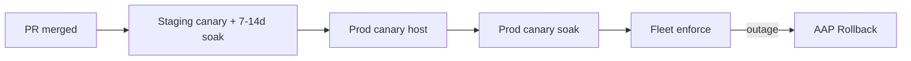

# 302 — Production readiness

Day-to-day runbook for **shipping SELinux policy** with application teams. Ansible Automation Platform (AAP) is the control plane. Developers PR policy from a **QA** host; you compile, package, canary, soak, and enforce on **prod**.

**How to read this guide:**

| You are… | Read first | Then |
|----------|------------|------|
| **New to SELinux** | [102-SELINUX_BASICS.md](../training/102-SELINUX_BASICS.md) sections 1–7.5 | This guide sections 1–4 |
| **Running day-to-day deploys** | [301-ANSIBLE_OPERATIONS.md](301-ANSIBLE_OPERATIONS.md) then [303-DENIAL_RESPONSE.md](303-DENIAL_RESPONSE.md) | Phases 1–6 as your checklist |
| **Reviewing policy PRs** | [207-SELINUX_BEST_PRACTICES.md](../policy/207-SELINUX_BEST_PRACTICES.md) §8 | PR template + CI mapping §15 |
| **Optional training** | [202-DEMO_GUIDE.md](../training/202-DEMO_GUIDE.md) (three-app talk) | This guide from section 4 onward |

**Learning path:** [203-RHEL_TWO_HOST.md](203-RHEL_TWO_HOST.md) → [301-ANSIBLE_OPERATIONS.md](301-ANSIBLE_OPERATIONS.md) → [303-DENIAL_RESPONSE.md](303-DENIAL_RESPONSE.md) → **this guide**. Concepts: [102-SELINUX_BASICS.md](../training/102-SELINUX_BASICS.md). **Doc index:** [README.md](../README.md).

**Where this guide applies:** two RHEL boxes (QA + prod) from a controller — [203-RHEL_TWO_HOST.md](203-RHEL_TWO_HOST.md). Commands like `semanage`, `semodule`, Ansible playbooks, and soak checks run on **those servers**.

---

## 1. Why production is different from the lab

High-blast-radius SELinux changes need **per-domain permissive soak**, **path labeling verification**, and **phased rollout** before you remove the permissive flag.

| Topic | Lab (`soak_min_days: 0` on **rhel-qa**) | Production |
|-------|------------------------------------------|------------|
| Soak wait | Skipped for the lab enforce on **QA** | **7–14 real calendar days** |
| Enforce | Lab inventory only — never copy onto prod | Enforce role **`collect_soak_facts.sh`** gate (or manual `check_soak_ready.sh` on host) |
| Goal | Teach the pipeline | **No surprise outages** |
| Rollback | Commands shown | Run `emergency_rollback.yml` if needed |

**Never** use `force_enforce=true` in production without documented break-glass approval and on-call awareness.

---

## 2. Plain-English glossary

| Term | Plain English |
|------|---------------|
| **Canary host** | One production node that gets new policy first — still permissive while you watch |
| **Soak** | Run permissive canary for 7–14 days so weekly cron, logrotate, and restarts surface missing rules |
| **Fleet** | All production hosts after canary proves stable |
| **Enforce gate** | Automated check (`collect_soak_facts.sh` in Ansible) — soak time elapsed + **net-new** access needs within limit (raw AVC fallback without `sesearch`) |
| **Break-glass** | `force_enforce=true` **and** a `change_ticket` — skip soak; use only in emergencies with approval |
| **Path labeling** | Files on disk must match `.fc` rules (`restorecon` + verify before restart) |
| **Per-domain permissive** | Only `myapp_t` is permissive; the OS stays **Enforcing** globally |
| **semanage** | Tool on the **server** that adds/removes domains from the permissive list (`-a` / `-d`) and manages ports/booleans in the live policy DB |
| **Vendor policy** | Module Red Hat already ships (JWS/Tomcat, EAP, httpd, …). Generate a custom module only when none exists; see §2.5 |

SELinux theory (labels, `.te`/`.fc`, `semanage` examples): [102-SELINUX_BASICS.md](../training/102-SELINUX_BASICS.md).

---

## 2.5 Do not duplicate vendor policy

Before anyone runs `dev_generate_policy.sh` against JWS, EAP, httpd, named, or postgresql, confirm Red Hat does not already ship the domain. Generating a second module that half-duplicates `jws6_tomcat` or `jboss_t` is worse than no custom policy. The generator refuses that path unless you pass `--force "reason"` (a reason is required and recorded on the PR). When the right answer is host tuning rather than a new module, re-run with `--tune-report` — it prints `semanage` / `setsebool` commands and writes `policy_out/tune_report.md` without generating a `.te`.

JWS/EAP policy is a **separate package** (`jws6-tomcat-selinux`, `eap7-selinux` / `eap8-selinux`) and is **not** installed by default. Until it is, the JVM runs `unconfined_java_t` — that is not confinement, and the fix is install the vendor RPM, not generate `myapp_t`.

```bash
# 1. Is a vendor module already loaded?
sudo semodule -l

# 2. Is a vendor SELinux RPM installed, or sitting in the local dnf cache unused?
rpm -qa '*selinux*'

# 3. Is this Tomcat/EAP still unconfined because the vendor RPM was never enabled?
ps -eZ | grep -E 'unconfined_java_t|unconfined_service_t'

# 4. If (1) is yes and the app is still denied: what should we tune?
bash scripts/dev_generate_policy.sh --tune-report --app-name tomcat
```

| Situation | Action | What you do |
|-----------|--------|-------------|
| `loaded` — `jws6_tomcat` / `jboss` / `httpd` in `semodule -l` | `tune` | `--tune-report`; run the printed `fcontext` / boolean / port commands. Do not generate. |
| `package_installed` — vendor SELinux RPM installed, module not loaded | `enable` | Enable that RPM. Do not generate. |
| `package_available` — RPM in dnf cache, not installed | `install` | `dnf install jws6-tomcat-selinux` (or `eap*-selinux`). Do not generate. |
| `unconfined` — `unconfined_java_t` on a Tomcat/EAP process | `install` | Same — vendor policy exists and is not enabled. |
| `base_policy` — httpd / named / postgresql via `selinux-policy-targeted` | `tune` | `--tune-report`. Do not generate. |
| `none` — custom app (Node, Spring Boot, demo `shopapi`) | `generate` | Generate is appropriate. |

`--force "reason"` on `dev_generate_policy.sh` is the escape hatch only when the app **genuinely differs** from the vendor one. Bare `--force` is rejected. The reason, situation, and bypassed module are recorded in `findings.json`, `pr_summary.md`, and a **HIGHER SCRUTINY** banner on the PR. Details: [204-DETERMINISTIC_POLICY.md](../developers/204-DETERMINISTIC_POLICY.md).

---

## 3. The rollout journey

Production is **never** auto-enforced on merge. You move through staging → prod canary → fleet enforce deliberately.



**Recommended sequence** ([203-RHEL_TWO_HOST.md](203-RHEL_TWO_HOST.md)):

```text
PR merge → compile / RPM (CLI: compile_and_validate.sh, build_rpms.sh)
         → AAP **Release canary** (`deploy_canary.yml --limit canary`)
         → scheduled **Soak monitor** (`soak_monitor.yml`, net-new vs installed policy)
         → AAP **Promote to enforce** (Soak status → approval → Enforce)
         → on denial: [303-DENIAL_RESPONSE.md](303-DENIAL_RESPONSE.md) (PR, not live patch)
```

---

## 3.5 Soak in plain English

**Soak** is not idle waiting — it is **active monitoring** while the app runs with **real policy** but **`myapp_t` still permissive**.

```text
Day 0     deploy_canary.yml
          → semodule -i myapp.pp + semanage permissive -a myapp_t
          → marker: /var/lib/myapp/selinux_canary_deployed_at

Week 1–2  Daily soak_monitor.yml (or monitor_avc.sh --max-net-new 0)
          → getenforce stays Enforcing; only app domain is log-only
          → net-new count vs installed policy (sesearch); raw AVC count is informational

Gate      collect_soak_facts.sh / enforce role passes ALL:
          → marker age ≥ 7 days
          → zero net-new access needs since marker (or raw AVC gate if sesearch unavailable)
          → deploy report at /var/lib/myapp/selinux_deploy_report.json with pass status + endpoint coverage

Enforce   semanage permissive -d myapp_t
          → denials now block the app if policy is incomplete
```

| Week | Admin action | Pass looks like |
|------|--------------|-----------------|
| **Week 0** | AAP **SELinux – Release canary** (or `deploy_canary.yml`) | App healthy; `myapp_t` in `semanage permissive -l`; marker file exists |
| **Week 1** | Daily AAP **SELinux – Soak monitor** | `net_new_count=0`, playbook `failed=0` |
| **Week 2** | AAP **SELinux – Promote to enforce** (Soak status → approval → Enforce) | `semanage permissive -l` empty; app still responds |
| **Enforce day** | Enforce node of **Promote to enforce** (`change_ticket` required) | Domain enforcing; HTTP probes from the manifest still succeed |

**Two-layer reminder:** `getenforce` = **Enforcing** throughout soak. Only **`myapp_t`** is on the permissive list until enforce.

**If policy changes during soak:** redeploy canary, extend `.te`, and **reset the soak clock** (new marker timestamp). See [§14 Troubleshooting](#14-troubleshooting).

Full timeline for beginners: [102-SELINUX_BASICS.md §7.5](../training/102-SELINUX_BASICS.md).

---

## 4. Three deploy paths

**Ansible Automation Platform (AAP) is the production path.** Click-create objects from [`ansible/aap/`](../../ansible/aap/). Compile with CLI scripts (`compile_and_validate.sh`, `packaging/build_rpms.sh`). PR review is [`.github/workflows/selinux-policy-ci.yml`](../../.github/workflows/selinux-policy-ci.yml) (`forbidden-patterns`, `version-consistency`). See [301-ANSIBLE_OPERATIONS.md](301-ANSIBLE_OPERATIONS.md).

| When | Who | How |
|------|-----|-----|
| **PR open** | CI (automatic) | `forbidden-patterns`, `version-consistency` ([`selinux-policy-ci.yml`](../../.github/workflows/selinux-policy-ci.yml); generator already ran the same check) |
| **Merge / release** | Admin | `compile_and_validate.sh` + `packaging/build_rpms.sh` on rhel-qa |
| **Production cutover** | Admin (manual) | AAP workflow **SELinux – Promote to enforce** (`enforce_production.yml`, `change_ticket` required) |

Manual Ansible (`ansible-playbook` or AAP) uses the playbooks in [`ansible/`](../../ansible/) — see phases below.

**Staging soak is scheduled Ansible, not a GitHub timer:** enable AAP job **SELinux – Soak monitor** daily. There is **no automatic enforce**. Wait 7–14 days, then run workflow **SELinux – Promote to enforce**. If soak fails: [303-DENIAL_RESPONSE.md](303-DENIAL_RESPONSE.md). The two-host talk shows a **clean** soak, then talk-only `force_enforce` so the recording can continue to the outage/rollback act.

---

## 5. Pre-production testing matrix

See also: [`205-TESTING.md`](../developers/205-TESTING.md) (full endpoint → policy mapping and `smoke_test.py` cases), [`ansible/README.md`](../../ansible/README.md) (playbook task order).

| Phase | Goal | Command / playbook | **Pass looks like** |
| --- | --- | --- | --- |
| **Syntax and compilation** | `.te` / `.fc` compile without errors | `bash scripts/compile_and_validate.sh selinux` on a host with `selinux-policy-devel` | `myapp.pp` built, no errors |
| **Semantic assertions** | Required allows present in compiled module | `bash scripts/validate_policy_semantics.sh selinux` on rhel-qa | `sesearch` checks pass |
| **Forbidden patterns** | No wildcards or high-privilege allows | `bash scripts/validate_forbidden_patterns.sh selinux` | `Forbidden-pattern checks passed` |
| **Path labeling** | On-disk contexts match `.fc` before restart | `bash scripts/verify_file_contexts.sh --log-dir /var/log/myapp` | `File context verification passed` |
| **Staging canary** | Permissive domain + integration smoke | `ansible-playbook ansible/deploy_canary.yml -i ansible/inventory.dev.yml` | All **six** endpoints return HTTP 200; services run as `myapp_t` / `myapp_backend_t`; deploy report `"status": "pass"` with `domain_context_verified: true` |
| **Canary AVC gate** | Block canary if denials already present | `deploy_canary.yml` (default `canary_max_avc=0`) | Playbook fails if recent `myapp_t` AVC count exceeds threshold |
| **Permissive soak** | Capture weekly cron, logrotate, restarts (7–14 days) | `ansible/soak_monitor.yml` daily (net-new vs installed policy) | `net_new_count=0`; raw AVC count informational |
| **Production canary host** | Deploy to one node before fleet | `deploy_canary.yml --limit canary` | Marker file written, app + backend healthy |
| **Blast-radius tiering** | Soak minimum from policy delta (fail-closed) | `bash scripts/run_blast_radius_fixtures.sh` (`make test-fixtures`) | All fixtures match `expected.json`; tier logic changes require fixture updates |
| **Enforce gate** | Automated soak + net-new + deploy report | `collect_soak_facts.sh` in `enforce_production.yml` (`soak_use_net_new: true`) | Role reports soak gate passed |
| **Production enforce** | Remove permissive domain | `ansible/enforce_production.yml` | `semanage permissive -l` empty; **six** production smoke tests pass under enforcing |
| **Outage response** | Instant relief + AVC capture | `ansible/emergency_rollback.yml` | Domain back in permissive list; endpoints pass; deploy report written; soak marker reset |

---

## 6. Phase 1 — Per-domain permissive soak (canary)

This phase is **canary soak after merge** — not the developer's **staging discovery** permissive (where the app team collects AVCs to write initial policy). Here the **full** `myapp.pp` is already installed; permissive mode lets you watch real workloads before enforce.

Enable permissive mode **only** for the application domain (OS stays enforcing):

```bash
sudo semanage permissive -a myapp_t
```

**Verify it is active:**

```bash
$ sudo semanage permissive -l
myapp_t
```

**Duration:** 7 to 14 days by default (`soak_min_days`). Optional **`check_soak_ready.sh --auto-tier`** adjusts the minimum using [`classify_policy_blast_radius.sh`](../../scripts/classify_policy_blast_radius.sh) (sesearch rule diff, not sediff). Tiering is **gated on** [`tests/fixtures/blast_radius/`](../../tests/fixtures/blast_radius/) — do not change tier logic without updating fixtures and passing **`make test-fixtures`**.

The canary playbook records a deploy timestamp at `/var/lib/myapp/selinux_canary_deployed_at` (epoch seconds), runs **`semodule -DB`** so dontaudit rules do not hide soak AVCs, and installs policy with **`semodule -i`** (in-place upgrade — no `semodule -r`). Production enforce refuses to run until soak requirements pass (unless `force_enforce=true` break-glass).

**Admin sign-off — host-level `semodule -DB`:** disabling dontaudit affects the **entire host**, not just `myapp_t`. If canary fails or rollback runs, playbooks call **`semodule -B`** to restore the baseline. If enforce never runs after a successful canary, `-DB` stays active until enforce — document this in the change ticket. Failed canary and rollback paths always restore `-B`.

**Admin sign-off — domain context verification:** deploy reports and soak gates require `wait_for_endpoints.sh` to confirm `shopapi.service` runs as **`shopapi_t`**. Without this check, a mislabeled entrypoint (`init_t`) can pass all HTTP gates with zero AVCs while the custom policy was never applied.

**Canary AVC gate:** `deploy_canary.yml` counts recent `myapp_t` AVC lines and **fails** if the count exceeds `canary_max_avc` (default **`0`**). Override only with explicit approval:

```bash
ansible-playbook ... ansible/deploy_canary.yml -e "canary_max_avc=2"
```

Do not raise the threshold to bypass missing policy — fix `.te`, redeploy, and re-soak instead.

**List vs add:** `semanage permissive -l` lists domains; `-a` adds, `-d` removes. See [102-SELINUX_BASICS.md §7](../training/102-SELINUX_BASICS.md).

---

## 7. Phase 2 — Path labeling verification

After `semodule -i`, existing files may retain old contexts. Verify **before** restarting the service:

```bash
sudo bash scripts/verify_file_contexts.sh \
  --install-root /opt/myapp \
  --var-dir /var/lib/myapp \
  --log-dir /var/log/myapp \
  --app-name myapp
```

**Pass looks like:**

```text
[INFO] File context verification passed for myapp
```

**Fail looks like** (would relabel on restorecon):

```text
[ERROR] restorecon dry-run would change: /var/log/myapp/data.log
```

This runs `matchpathcon` on key paths and fails if `restorecon -Rv -n` would relabel anything under the data directory.

Always run verification immediately after policy install and before `systemctl restart`.

Full `restorecon` walkthrough: [102-SELINUX_BASICS.md §6](../training/102-SELINUX_BASICS.md).

---

## 8. Phase 3 — Systemd and cron attestation

Staging tests must use **systemd**, not a manual java/python launch:

```bash
sudo systemctl restart shopapi.service
sudo systemctl is-active shopapi.service
curl -sf http://127.0.0.1:8091/log
```

**Cron (optional — does not run as the app domain):**

A root crontab entry runs as **`cron_t`**, not `shopapi_t`. Use it only to illustrate why real production soak must include schedulers that run **as the app domain** (systemd timers, app-owned cron, etc.). Do not treat a root cron smoke as evidence the app domain is ready.

For staging discovery on **shopapi**, `GET /log` (in `shopapi_t`) exercises log writes.

That HTTP path does **not** replace real `logrotate` cron. Production soak must capture AVCs from `logrotate_t` (and any other scheduler domain) and extend policy before enforce.

**Monitoring agents (Datadog, Promtail, Prometheus):** org-specific domains — verify manually during soak if agents read `/var/lib/myapp`.

---

## 9. Phase 4 — Daily AVC monitoring

During soak, run **Ansible** — do not clone the git repo onto production hosts. Ops scripts live in the **`selinux-policy-ops`** RPM at `/usr/libexec/selinux-policy-ops`.

**AAP (recommended):** schedule job template **SELinux – Soak monitor** (`soak_monitor.yml`) daily on the canary group.

**Manual playbook:**

```bash
ansible-playbook -i ansible/inventory.production.yml ansible/soak_monitor.yml --limit canary
ansible-playbook -i ansible/inventory.production.yml ansible/soak_status.yml --limit canary
```

**Ad-hoc on the host** (ops RPM installed):

```bash
/usr/libexec/selinux-policy-ops/monitor_avc.sh \
  --manifest /etc/myapp/selinux-manifest.yml \
  --marker-file /var/lib/myapp/selinux_canary_deployed_at \
  --max-net-new 0 \
  --format json
```

The JSON payload includes `count` (raw lines), `net_new_count` (unique access needs **not** already allowed by **installed** policy), `exceptions[]`, and `avc_fail_closed` (true if `sesearch` is missing).

**Pass looks like:** `net_new_count=0` (duplicate AVC lines from cron do **not** fail the gate).

**Fail looks like:** `net_new_count` > `soak_max_net_new` — investigate `exceptions[]`, extend `.te`, PR, redeploy canary, **reset the soak clock**.

Install **`setools-console`** on canary/prod (`selinux-policy-ops` Requires it). Playbooks **fail** if `sesearch` is missing.

**Optional webhook** (still via `monitor_avc.sh` flags if you wrap the script): `--notify-webhook URL` on failure.

---

## 10. Phase 5 — Production canary host groups

Copy [`ansible/inventory.production.example.yml`](../../ansible/inventory.production.example.yml) to `ansible/inventory.production.yml`.

**Inventory layout:**

```text
inventory.production.yml
├── canary group     → prod-canary-1 only (first)
└── production group → all prod hosts (canary + fleet)
```

The `canary` group is **one node** for the first production deploy. The `production` group includes canary plus the rest of the fleet for later rollout.

**Step-by-step:**

```bash
# 1. Canary node only (permissive + policy install)
ansible-playbook -i ansible/inventory.production.yml ansible/deploy_canary.yml \
  --limit canary

# 2. Daily monitoring on canary during soak (AAP schedule or ansible-playbook)
ansible-playbook -i ansible/inventory.production.yml ansible/soak_monitor.yml \
  --limit canary

# 3. Optional: permissive rollout to full fleet before enforce
ansible-playbook -i ansible/inventory.production.yml ansible/deploy_canary.yml \
  --limit production

# 4. AAP Promote to enforce (Soak status → approval → Enforce; change_ticket required)
ansible-playbook -i ansible/inventory.production.yml ansible/soak_status.yml --limit canary
ansible-playbook -i ansible/inventory.production.yml ansible/enforce_production.yml \
  -e change_ticket=CHG123

# Break-glass only:
ansible-playbook ... enforce_production.yml -e change_ticket=CHG123 -e "force_enforce=true"
```

Production inventory uses **RPMs** (`policy_pp_src: ""`). Lab inventories pass `policy_pp_src` and `selinux_ops_from_package: false` — see [ansible/README.md](../../ansible/README.md).

**`--limit canary`** targets only hosts in the `canary` group — not the full fleet. Use `--limit production` when rolling policy to all nodes while still permissive.

---

## 11. Phase 6 — Emergency rollback

If enforce causes an outage, run **`ansible-playbook ... ansible/emergency_rollback.yml`** (AAP **SELinux – Rollback**). The playbook **sets the domain permissive first** (stock `semanage` / Ansible modules), then optional **`dnf downgrade myapp-selinux-<version>`** when `rollback_dnf_version` is set, then `semodule -B`, `restorecon`, and service restarts. It exports AVCs to **`/tmp/emergency_avc.log`**.

**Policy generation is controller-only:** run **`ansible/generate_emergency_patch.yml`** against a **git checkout on localhost**. It writes `policy_out/` for a PR. Do **not** run it on production hosts or `semodule -i` the output. Optional `OPENAI_API_KEY` polishes `pr_summary.md` only. See [303-DENIAL_RESPONSE.md](303-DENIAL_RESPONSE.md).

**Interrupted canary** (host left on `semodule -DB`): run **`ansible/reset_host_state.yml`** to restore dontaudit and clear permissive without changing the installed module.

Optional ops scripts (`wait_for_endpoints`, deploy report) run only when **`selinux-policy-ops`** is installed on the host.

See [`ansible/emergency_rollback.yml`](../../ansible/emergency_rollback.yml), [`ansible/reset_host_state.yml`](../../ansible/reset_host_state.yml), and [`ansible/generate_emergency_patch.yml`](../../ansible/generate_emergency_patch.yml).

The two-host talk track shows RPM install, **clean soak**, talk-only enforce, `/feature-spool` outage, and admin rollback in [203-RHEL_TWO_HOST.md](203-RHEL_TWO_HOST.md) and `scripts/demo_e2e_*.sh` (shopapi on :8091). The recording may pass `force_enforce=true` plus a change ticket so prod enforce can finish after a clean soak; `soak_min_days: 7` on production inventory is unchanged.

---

## 12. Enforce pre-checks (automated)

`enforce_production.yml` runs before removing permissive:

1. **`collect_soak_facts.sh`** (role) — minimum soak days + **net-new** access needs (or raw AVC if `avc_fail_closed`) + passing deploy report with verified domain context (same checks as manual **`check_soak_ready.sh`** / **`soak_status.yml`**; optional **`--auto-tier`** with base/candidate policy paths on the controller)
2. **`verify_file_contexts.sh`** — labeling dry-run (`restorecon` + `.fc` is source of truth)
3. **Restart units from the app manifest** (demo: `shopapi.service`)
4. **Unified readiness** — `wait_for_endpoints.sh --manifest …` (systemd + domain context + that app’s HTTP list)
5. **Deploy report** — `post_deploy_report.sh` writes `/var/lib/<app>/selinux_deploy_report.json` including `domain_context`

The two-host demo inventory uses **shopapi** (`/health` `/state` `/log` on :8091).

Enforce runs inside an Ansible **block/rescue**: if smoke tests or the deploy report fail, the playbook restores **the app domain** to permissive, restarts services, re-checks endpoints, then fails with guidance to inspect AVCs and the deploy report.

```bash
bash scripts/wait_for_endpoints.sh --host 127.0.0.1 --retries 15 --delay 2
bash scripts/post_deploy_report.sh --phase enforce --domain myapp_t --var-dir /var/lib/myapp \
  --marker-file /var/lib/myapp/selinux_canary_deployed_at --project-root /path/to/selinux-pac
```

`deploy_canary.yml` runs the same Tier 6 endpoints (minus `/`) during canary exercise, with the same backend and notify-socket waits.

### `check_soak_ready.sh` — pass vs fail examples

Prefer **`ansible-playbook … soak_status.yml`** on the controller. The host CLI below is the same gate (`collect_soak_facts.sh` JSON). With `setools-console`, enforce uses **net-new**; the text below still shows the raw-count messages from the script when fail-closed.

**FAIL — canary deployed today:**

```bash
$ bash scripts/check_soak_ready.sh \
    --domain myapp_t \
    --marker-file /var/lib/myapp/selinux_canary_deployed_at

[INFO] Soak: 1 day(s) elapsed (minimum 7)
[INFO] Events since canary deploy for myapp_t: 0 (maximum 0)
[ERROR] Soak period not met — wait 6 more day(s) or use force_enforce=true (break-glass only)
```

**FAIL — AVCs still appearing:**

```bash
[INFO] Soak: 10 day(s) elapsed (minimum 7)
[INFO] Events since canary deploy for myapp_t: 2 (maximum 0)
[ERROR] Too many SELinux events since canary deploy (2 > 0)
```

**PASS — after 8 days, zero AVCs:**

```bash
$ bash scripts/check_soak_ready.sh \
    --domain myapp_t \
    --marker-file /var/lib/myapp/selinux_canary_deployed_at

[INFO] Soak: 8 day(s) elapsed (minimum 7)
[INFO] Events since canary deploy for myapp_t: 0 (maximum 0)
[INFO] Soak gate passed — safe to enforce myapp_t
```

Manual pre-check before enforce:

```bash
bash scripts/check_soak_ready.sh \
  --domain myapp_t \
  --marker-file /var/lib/myapp/selinux_canary_deployed_at
```

Optional blast-radius minimum (controller; requires previous + candidate module sources):

```bash
bash scripts/check_soak_ready.sh \
  --auto-tier \
  --base-policy selinux/myapp.te \
  --candidate-policy policy_out/myapp.te \
  --marker-file /var/lib/myapp/selinux_canary_deployed_at \
  --min-days 7
```

Logs **`Blast-radius tier:`** and **`Classifier reason:`** on success; on classifier failure keeps **`soak_min_days`** (fail-closed).

---

## 12.5 App team incident card

When SELinux deploy or enforce affects the app, app teams need fast, non-ambiguous signals — not generic HTTP 500s that look like application regressions.

### What you will see

| Signal | Likely meaning |
|--------|----------------|
| `systemctl status myapp` / `myapp-backend` → `failed` | Service did not start after policy restart |
| `GET /` returns `"selinux": { "domain_permissive": false, "mode": "Enforcing" }` | Enforce is active — denials now block |
| Endpoint JSON includes `"selinux_context"` and `"Permission denied"` | SELinux denial (check AVCs, not app logic first) |
| `/var/lib/myapp/selinux_deploy_report.json` with `"status": "fail"` | Last canary/enforce/rollback deploy did not pass smoke |

### 60-second checklist (app team)

```bash
systemctl is-active myapp myapp-backend
curl -sf http://127.0.0.1:8091/health
bash scripts/wait_for_endpoints.sh --host 127.0.0.1 --retries 3 --delay 2
cat /var/lib/myapp/selinux_deploy_report.json
```

### Do / do not

| Do | Do not |
|----|--------|
| Page the SELinux/admin on-call with deploy phase + report JSON | Run `setenforce 0` globally |
| Capture `ausearch -m avc -ts recent` excerpt | Add broad `bin_t` execute rules locally |
| Retry after admin sets domain permissive or patches policy | Re-deploy app code alone without policy fix |

### Expected recovery loop

Follow [303-DENIAL_RESPONSE.md](303-DENIAL_RESPONSE.md). Do not live-patch the host.

```text
Outage → AAP Rollback (domain permissive) → export AVCs → policy PR → AAP Release canary → soak → Promote to enforce
```

Deploy feedback artifact: **`/var/lib/myapp/selinux_deploy_report.json`** (written by canary, enforce, and rollback playbooks). Soak-fail artifact: **`/var/lib/myapp/selinux_soak_last_fail.json`**.

---

## 13. Admin sign-off checklist

Before you enforce on production, confirm:

- [ ] Staging soak **7+ days** complete
- [ ] `soak_monitor.yml` (or `monitor_avc.sh --max-net-new 0`) clean for a full business cycle (including weekends)
- [ ] Prod canary host deployed and soaked separately
- [ ] `verify_file_contexts.sh` passed after last canary deploy
- [ ] Backend unit active; health and notify probes succeed on canary host
- [ ] PR admin review table signed off ([PR template](../../.github/PULL_REQUEST_TEMPLATE/selinux_policy_review.md))
- [ ] Change ticket documents enforce window and rollback owner
- [ ] Rollback playbook tested on staging **or** on-call briefed on `emergency_rollback.yml`
- [ ] `semanage permissive -l` shows the app domain on target hosts (still permissive pre-enforce)
- [ ] `setools-console` installed on canary/prod (`sesearch` required; playbooks fail if missing)

---

## 14. Troubleshooting

| Problem | What it looks like | What to do |
|---------|-------------------|------------|
| **Enforce fails soak gate** | `Soak period not met` or `Too many AVC denials` | Wait remaining days; fix policy from AVCs; redeploy canary — do **not** use `force_enforce` without approval |
| **Mislabeled files after deploy** | `verify_file_contexts.sh` fails | Run `restorecon -Rv /opt/myapp /var/lib/myapp /var/log/myapp /run/myapp`; re-verify; see [Basics §6](../training/102-SELINUX_BASICS.md) |
| **AVCs spike during soak** | `soak_monitor.yml` fails (`net_new_count` > 0) | [303-DENIAL_RESPONSE.md](303-DENIAL_RESPONSE.md) — copy `selinux_soak_last_fail.*`, PR, recanary; **reset soak clock**. Do **not** `semodule -i` on the host |
| **Ansible inventory missing** | `Could not match supplied host pattern` | Copy `inventory.production.example.yml` → `inventory.production.yml`; set real hostnames |
| **Canary marker missing** | `Canary marker not found` | Run `deploy_canary.yml` first — marker is written on canary deploy |
| **Audit tools unavailable** | `Could not determine AVC count` | Install `audit` package; ensure `auditd` is running |
| **App fails after enforce** | curl errors; AVCs in enforcing mode | `semanage permissive -a myapp_t` immediately; run emergency rollback playbook |
| **`/notify-socket` fails post-enforce** | HTTP 500; stale socket on disk | Remove `/run/myapp/notify.sock` and restart backend; playbooks do this automatically |
| **`/probe-backend` fails post-enforce** | `Permission denied` on TCP connect | Check backend on `:8889`; look for `tcp_socket getopt` or `cert_t` AVCs on `myapp_t` |
| **`/run-script` fails post-enforce** | `Permission denied` on `/usr/bin/*` | Do not add `bin_t:file execute` — fix `backup.sh` to use bash builtins |
| **Wrong cron path** | cron job fails silently | Use AAP **Soak monitor** or `/usr/libexec/selinux-policy-ops/monitor_avc.sh` — do **not** clone this repo onto prod |
| **Generator refuses (vendor policy)** | `vendor policy already loaded` or `available but not installed` | Install/enable the vendor RPM, or `--tune-report` for host commands. `--force "reason"` only if the app is not the vendor one. See §2.5 |

---

## 15. CI mapping (developer PR)

| Admin PR table row | Where it runs |
| --- | --- |
| No over-permissive grants | GHA `forbidden-patterns` (`validate_forbidden_patterns.sh`; generator already ran this) |
| Compilation test | `compile_and_validate.sh` on **rhel-qa** (not GitHub) |
| Semantic policy checks | `validate_policy_semantics.sh` on **rhel-qa** |
| Version SSOT | GHA `version-consistency` |
| Policy access delta (review aid) | `assemble_pr_body.sh` locally |
| Soak tier logic (do not change without fixtures) | `make test-fixtures` / `run_blast_radius_fixtures.sh` |
| Canary readiness | AAP **Release canary** / `deploy_canary.yml` |
| Post-canary endpoint smoke | `wait_for_endpoints.sh` + deploy report |
| Canary AVC gate at deploy | `deploy_canary.yml` (`canary_max_avc`, default 0) |
| Soak net-new | `soak_monitor.yml` / `collect_soak_facts.sh` (`soak_max_net_new`) |

Optional LLM polish of `pr_summary.md` uses `OPENAI_API_KEY` on the **controller** (`generate_emergency_patch.yml` / `--llm-summary`), not a GitHub deploy workflow.

Packaged installs: [`packaging/myapp-selinux.spec`](../../packaging/myapp-selinux.spec) builds an RPM from `selinux/` for hosts that prefer package delivery over playbook copy.

Developer workflow and PR assembly: [README.md](../../README.md) and [202-DEMO_GUIDE.md](../training/202-DEMO_GUIDE.md).

---

## Document map

| Guide | Sections to read | Audience |
|-------|------------------|----------|
| [102-SELINUX_BASICS.md](../training/102-SELINUX_BASICS.md) | §7 two-layer model; §7.5 soak timeline; §8 avc.log filter | New to SELinux |
| [207-SELINUX_BEST_PRACTICES.md](../policy/207-SELINUX_BEST_PRACTICES.md) | §1–6 principles; §8 review checklist | Policy authors and security reviewers |
| [202-DEMO_GUIDE.md](../training/202-DEMO_GUIDE.md) | Three-app customer talk (`demo_present.sh`); two-host pipeline (`demo_e2e_*.sh`) | Presenters |
| [204-DETERMINISTIC_POLICY.md](../developers/204-DETERMINISTIC_POLICY.md) | Default offline generator, sepolgen banners, fixtures | Policy authors without LLM |
| [301-ANSIBLE_OPERATIONS.md](301-ANSIBLE_OPERATIONS.md) | AAP workflows in `ansible/aap/`, soak monitor, extra-vars | RHEL admins |
| [303-DENIAL_RESPONSE.md](303-DENIAL_RESPONSE.md) | File/port AVC after ship → PR, not live patch | RHEL admins |
| [304-ADOPTION_CHECKLIST.md](304-ADOPTION_CHECKLIST.md) | CODEOWNERS, inventories, RPM repo | Platform team |
| **This file** | §3.5 soak; §5–14 phases and checklist | RHEL admins |
| [README.md](../../README.md) | Developer commands + admin pointer | Day-to-day |
